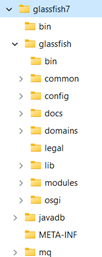
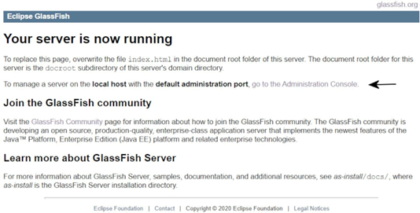
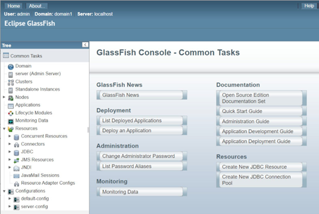

# Jakarta RESTful Web Services 3.1 Workshop

## Participante

### **Módulo 1: Configuración del Entorno.**

Para realizar todas las tareas de este taller necesitarás los siguientes programas. Cada uno de estos programas está disponible para Windows, macOS y Linux.

Se supone que conoces tu ordenador lo suficientemente bien como para que no sea necesario revisar cómo se instala cada programa. 

Si no es así, los presentadores del taller podrán ayudarle. 

La lista de programas es la siguiente:

1. Java 17

2. IDE (opcional)

3. Maven (versión más reciente)

4. Glassfish 7.x.y (versión más reciente de 7.x.y)

5. Derby DB.

6. CURL (versión más reciente)
A continuación encontrará información sobre dónde encontrar este software y cómo instalarlo.

## Java SE 17

Existen numerosas distribuciones de Java aparte de la de Oracle. Uno de los puntos fuertes de Java ha sido que, desde la perspectiva de un desarrollador, no importa qué entorno de desarrollo utilice. Recomiendo **Adoptium**, el nuevo nombre de **AdoptOpenJDK**, que distribuye la distribución de Eclipse llamada **Temurin**, un anagrama de la palabra 'runtime'. En [htps://adoptium.net/](https://adoptium.net/) encontrarás compilaciones de **OpenJDK** para la mayoría de sistemas operativos y plataformas de CPU.

Estamos usando Java 17 ya que las librerías de Jakarta 10 pueden correr en esta versión. Se trata de una versión de soporte a largo plazo y las versiones de Jakarta suelen estar vinculadas a una versión LTS.

No olvides configurar la variable de entorno **JAVA_HOME** y actualizar el **PATH**.

Ahora vamos a instalar Maven.

## Maven

Todo el código de ejemplo está organizado para su uso con la herramienta de compilación Apache Maven. La mayoría de los IDEs incluyen Maven, por lo que si usted está usando uno puede pensar que no es necesario descargar e instalar la versión de línea de comandos. Puedes descargar Maven desde [htps://maven.apache.org/download.cgi.](https://maven.apache.org/download.cgi) Al igual que cURL y GlassFish se distribuye como un archivo comprimido que puedes descomprimir en cualquier lugar. También debes añadir la ruta a la carpeta bin. Se recomienda **utilizar** la versión más reciente.

## IDE

Este taller no asume que usted usará un IDE específico. Ahora vamos a instalar el servidor de aplicaciones Glassfish.

## Glassfish 7

Existen numerosos servidores de aplicaciones Java. Cuando Oracle mantenía Java EE, el servidor Glassfish era el servidor de referencia. Todos los demás servidores proporcionaban, como mínimo, los mismos servicios que se encuentran en Glassfish. Hoy Glassfish es la implementación de Eclipse de Jakarta EE. En lugar de un servidor de referencia, Jakarta define tres profiles. Estos son plataforma, web y núcleo. Glassfish soporta todos los profiles. Puedes usar otro servidor como Wildfly u OpenLiberty pero todas las instrucciones del taller asumen Glassfish.

Visite [htps://glassfish.org/download](https://glassfish.org/download) y seleccione la versión más reciente. En la preparación de este taller la versión más reciente fue **Eclipse GlassFish 7.0.5, Jakarta EE Platform, 10**. La versión que puedes descargar puede ser differente a la 7.0.5 sin embargo para los propósitos de este taller cualquier versión 7.0.5 o superior funcionará.

La descarga no es más que un archivo comprimido que puedes descomprimir en la carpeta que desees. 

Esta es la estructura de carpetas de Glassfish después de descomprimirlo.

Add the location of the **bin** folder, for example in Windows, **C:\\devapp\\glassfish7\\bin**, to your path. Open a terminal/console and enter in any OS::

Añade la ubicación de la carpeta **bin**, por ejemplo en Windows, **C:\devapp\glassfish7\bin**, a tu ruta. Abre un terminal/consola y escribe en cualquier SO::

Para iniciar GlassFish: `asadmin start-domain`

Debería ver como última línea de la salida Comando iniciar-dominio ejecutado con éxito.

Para detener a GlassFish: `asadmin stop-domain`

Usted debe ver como la última línea de la salida:

Command stop-domain executed successfully.
`El comando detener-dominio se ha ejecutado correctamente.`

Ahora puede probar Glassfish abriendo su navegador e introduciendo en la barra de direcciones **localhost:8080**.

Deberías ver:

Con el servidor en funcionamiento, visite la Consola de Administración haciendo clic en el enlace que señala la flecha. Ahora debería ver:

Para detener el servidor, abra un terminal en la misma carpeta en la que ejecutó.

Para detener el servidor, abra un terminal en la carpeta **glassfish7/glassfish/bin** y ejecute el archivo **stopserv.bat** si su sistema operativo es Windows, de lo contrario para Linux o macOS ejecute **stopserv**. Esto supone que ha actualizado su ruta. Para Linux o macOS puede que tengas que configurar los permisos para que **stopserv** sea ejecutable. Deberías ver un mensaje parecido a este:

Waiting for the domain to stop . Waiting finished after 60 ms.

`Esperando a que el dominio se detenga . Espera finalizada después de 60 ms.`

Command stop-domain executed successfully.
`El comando detener-dominio se ha ejecutado correctamente`

El siguiente paso es la base de datos Derby.

## Derby

El servidor GlassFish incluye la base de datos Derby. Para iniciar Derby vaya a **`[donde haya colocado GlassFish]/glassfish7/javadb/bin`**, abra un terminal/consola en esta carpeta y ejecute el script startNetworkServer. Esto iniciará Derby monitorizando el puerto 1527. La herramienta de línea de comandos para Derby es if, que también se encuentra en la carpeta bin.

Derby también se puede descargar desde htps://db.apache.org/derby/derby_downloads.html.

La siguiente es cURL, la herramienta htp de línea de comandos.

### cURL

Cuando introduces una URL en un navegador siempre estás haciendo una petición GET. 

Al aprender sobre servicios RESTful, necesitaremos hacer peticiones GET, POST, PUT y DELETE. Hay peticiones adicionales, pero nos centraremos en estas cuatro. 

El cURL es un programa de línea de comandos que permite enviar una PETICIÓN con cualquiera de los verbos permitidos. Se trata de una herramienta muy valiosa a la hora de desarrollar servicios RESTful, ya que permite probar el servicio sin necesidad de crear una aplicación cliente. 

Visita [https://curl.se/download.html](https://curl.se/download.html) para descargar el archivo comprimido adecuado. Descomprime el archivo donde quieras. Añade la ubicación de la carpeta bin a tu ruta.

### Solución de problemas

Un problema común es no configurar correctamente la instalación de Java. A continuación se explica cómo diagnosticar un problema de configuración de Java. En primer lugar, puede determinar si Java está correctamente instalado introduciendo en la consola de cualquier sistema operativo **java -version**. Debería ver algo como

**openjdk version "17.0.7" 2023-04-18**

**OpenJDK Runtime Environment Temurin-17.0.7+7 (build 17.0.7+7)**

**OpenJDK 64-Bit Server VM Temurin-17.0.7+7 (build 17.0.7+7, mixed mode, sharing)**

Este taller requiere Java 17. Se muestra arriba es 17.0.7 pero cualquier 17.x.y debería funcionar. Las versiones de Java a partir de la 18 no son compatibles. Java 21 será compatible con Jakarta 11.

Si esta información es incorrecta o no puede encontrar el archivo ejecutable de Java, siga estos pasos para corregir el problema.

### Windows

Abre la consola e introduce el comando **set**. Deberías encontrar la variable de entorno JAVA_HOME que debería mostrar la carpeta en la que se instaló Java. El **PATH** debe incluir la ruta completa a la carpeta bin en la carpeta de Java.

**` JAVA_HOME=C:\devapp\jdk-17.0.7+7 PATH=%JAVA_HOME%\bin;%PATH%`**

Si faltan, deben configurarse manualmente en el cuadro de diálogo **Variables de entorno**. En Windows 10 u 11 introduzca **environment** en el cuadro de búsqueda que se encuentra en la barra de tareas y seleccione **Editar las variables de entorno del sistema**. Aquí puede añadir o corregir **JAVA_HOME** y **PATH**.

### Linux

Utilice el comando **printenv** para verificar **JAVA_HOME** y **PATH**. Si faltan o el valor asignado es incorrecto, abre un editor de texto y abre tu archivo **.profile** en tu directorio personal. Añada la siguiente línea sustituyendo **JAVA_HOME** por la ubicación en la que instaló Java.

###### `export JAVA_HOME=/home/javadev/java/jdk-17.0.7+7`

Sustituye **javadev** por tu nombre de usuario.

Si el **PATH** es incorrecto, añada esta línea a **.profile**. 

###### `export PATH=\$JAVA_HOME/bin:\$PATH`

# macOS

Utilice el comando **printenv** para verificar **JAVA_HOME** y **PATH**. Si faltan o el valor asignado es incorrecto abre un editor de texto y abre tu archivo **.bash_profile** en tu directorio home. Añada la siguiente línea sustituyendo **JAVA_HOME** por la ubicación en la que instaló Java.

Añada la siguiente línea sustituyendo **JAVA_HOME** por la ubicación en la que instaló Java en el fichero.

###### ` export JAVA_HOME=/Users/javadev/java/jdk-17.07+7/Contents/Home`

Sustituye **javadev** por tu nombre de usuario.

Si el **PATH** es incorrecto, añada esta línea a **.profile**.

###### `export PATH=\$JAVA_HOME/bin:\$PATH`

# Módulo 1 Conclusión

Este módulo trata sobre la configuración del entorno de desarrollo. 

No es sólo para Jakarta REST sino para cualquier componente Jakarta que desees utilizar. 

Estás casi listo para escribir tu primer servicio pero primero necesitamos una tarea que queramos exponer como servicio. Ese es el tema del próximo módulo.

