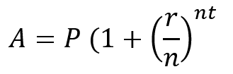
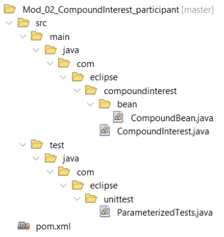

# Jakarta RESTful Web Services 3.1 Workshop

## Participante

### **Módulo 2: Codificación de la tarea que se convertirá en un servicio.**

En este módulo codificarás clases que calcularán el valor del dinero depositado en una cuenta que pagará intereses compuestos durante un periodo especificado a un tipo de interés determinado. Esta es la fórmula que utilizarás:

**P** : es el monto principal depositado en una cuenta de interés compuesto

**r** : es el tipo de interés expresado normalmente como tasa anual

**n** : es el número de periodos de capitalización (si se capitaliza mensualmente, el valor es 12)

**t** : es el tiempo de capitalización del dinero. Suele expresarse en años y debe dividirse por el número de periodos de capitalización, que en este caso será de 12.

Para simplificar esta tarea, utilizará el proyecto mod_02_compoundinterest_presenter.

con todos los componentes necesarios, incluidas las pruebas unitarias. Piense en esto como un ejemplo simplificado de Test-Driven Development o TDD.

### **El Proyecto**

El proyecto está basado en Maven como todos los proyectos de este taller. Tiene todos los archivos fuente necesarios pero con algunos métodos dejados vacíos. Tu tarea es completar el código que falta. Aquí está el diseño Maven del proyecto.

### **Lo que hay que hacer.**

Usted es libre de escribir una solución diferente, pero debe ser capaz de pasar las pruebas unitarias. Aquí están las descripciones de los componentes en el proyecto. 

Hay tres archivos cuyos comentarios debes leer. Los archivos son:

**CompoundInterest.java**

Este es el archivo donde implementará la fórmula del interés compuesto.

**CompoundBean.java**

Este es el Java Bean que se utilizará en la fórmula. Está completo.

**ParamerterizedTests.java**

Esta es una clase de prueba parametrizada JUnit5. Es completa.

Tal vez le parezca que podría organizar mejor el código para el cálculo y los datos. Siéntete libre de hacerlo. El objetivo es implementar un sencillo cálculo financiero con comprobación básica de errores para que a su vez pueda convertirse en un servicio web.

El archivo pom.xml también está comentado y debe ser revisado. Contiene un elemento defaultGoal que limpiará, compilará y probará el proyecto.

**Si ejecuta el código en una configuración regional que utiliza una coma en lugar de un punto decimal, cambie @CsvSource en la clase de prueba unitaria.**

### **Su tarea**

Implemente el cálculo de la fórmula mostrada anteriormente y haga que pase la prueba unitaria. Los presentadores del taller estarán encantados de responder a cualquier pregunta que pueda tener.

