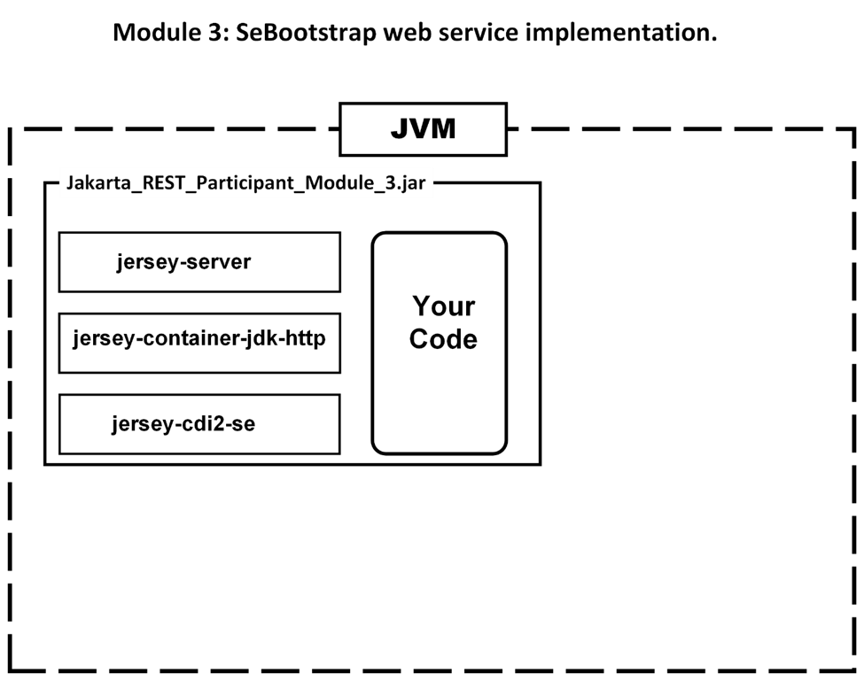
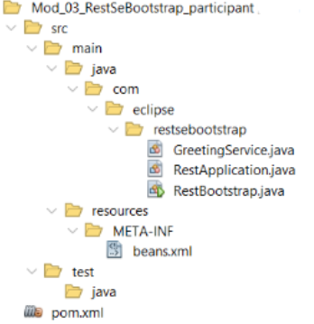

# Jakarta RESTful Web Services 3.1 Workshop

## Participante

### Módulo 3: Implementación de un servicio web SeBootstrap.

****

En este módulo examinaremos un servicio web simple que utiliza uno de dos servidores integrados, Jersey o RestEasy. Jakarata EE 10 continúa simplificando lo necesario para escribir un servicio. Comencemos revisando la organización del programa de `mod_03_restsebootsrap_participant`. 
Cargue el proyecto en el IDE de su elección o utilice un editor de texto para abrir o crear archivos como se describe.

### El Proyecto
Aunque sólo hay un proyecto, emplea Maven `<profiles>` para determinar qué dependencias de la biblioteca a utilizar. Al adherirnos a la API Jakarta REST 3.1, podemos utilizar las implementaciones Jersey o `RESTEasy` sin ningún cambio en nuestro código fuente. El proyecto se llama:

### `Mod_03_RestSeBootstrap_participant.`

Este es el diseño del proyecto definido por Maven.



Usted escribirá los tres archivos de clase que se muestran en el paquete `com.eclipse.restsebootstrap` después de esta revisión de otros archivos en este proyecto.

### Veamos el archivo beans.xml

Este es un proyecto Java SE, no un proyecto Jakarta Web. Hay un componente normalmente asociado a las aplicaciones web y es el fichero beans.xml. Este es idéntico a la versión web. ¿Por qué lo necesitamos? Lo necesitamos si el proyecto utiliza Context Dependency Injection o CDI.

El archivo beans.xml tiene un propósito simple. Por su existencia en un proyecto, hace que CDI, asumiendo que todas las dependencias requeridas están en su lugar, esté disponible para la aplicación. Aquí está el archivo:

```
<beans xmlns="https://jakarta.ee/xml/ns/jakartaee"
    xmlns:xsi="http://www.w3.org/2001/XMLSchema-instance"
    xsi:schemaLocation="https://jakarta.ee/xml/ns/jakartaee
    https://jakarta.ee/xml/ns/jakartaee/beans_4_0.xsd"
 bean-discovery-mode="annotated" version="4.0">
</beans>
```

Lo que nos interesa es el atributo `bean-discovery-mode`. Las dos opciones habituales son «all» y «annotated». La mejor práctica es utilizar `annotated`. En un tiempo era necesario listar todas las clases que querías que fueran capaces de CDI pero ahora las anotaciones hacen esta tarea.

### Veamos el archivo pom.xml

Examinaremos dos secciones del archivo pom, las dependencias y el build/plugin. Aquí están las dependencias para el ejemplo basado en Jersey. El archivo pom está completo.

```
<dependencies>
 <!-- The following three dependencies are required to use 
 SeBootstrap -->
   <dependency>
      <groupId>org.glassfish.jersey.core</groupId>
      <artifactId>jersey-server</artifactId>
      <version>3.1.2</version>
   </dependency>
   <dependency>
      <groupId>org.glassfish.jersey.containers</groupId>
      <artifactId>jersey-container-jdk-http</artifactId>
      <version>3.1.2</version>
   </dependency>
   <dependency>
      <groupId>org.glassfish.jersey.inject</groupId>
      <artifactId>jersey-cdi2-se</artifactId>
      <version>3.1.2</version>
   </dependency>
</dependencies>
```

Si utiliza la biblioteca RESTEasy, existen 4 dependencias.

```
<dependencies>
 <!-- These 4 dependencies are required for RESTEasy library -->
 <dependency>
      <groupId>org.jboss.resteasy</groupId>
      <artifactId>resteasy-core</artifactId>
      <version>6.2.4.Final</version>
   </dependency>
   <dependency>
      <groupId>org.jboss.resteasy</groupId>
      <artifactId>resteasy-undertow</artifactId>
      <version>6.2.4.Final</version>
   </dependency>
   <dependency>
 <!-- JSON dependency -->
      <groupId>org.jboss.resteasy</groupId>
      <artifactId>resteasy-json-binding-provider</artifactId>
      <version>6.2.4.Final</version>
   </dependency>
   <dependency>
 <!-- CDI dependency -->
      <groupId>org.jboss.weld.se</groupId>
      <artifactId>weld-se-shaded</artifactId>
      <version>5.1.0.Final</version>
      <type>jar</type>
   </dependency>
</dependencies>
```

Podemos tener ambos conjuntos de dependencias en el mismo archivo pom mediante la creación de dos perfiles. Cambiando el `activeByDefault`, usando true o false, puedes seleccionar el perfil a usar. Prueba cada perfil.
```
   <profiles>
      <profile>
         <id>jersey</id>
         <activation>
            <activeByDefault>true</activeByDefault>
         </activation>
         <dependencies>
```

`            The Jersey dependencies go here`

```
         </dependencies>
      </profile>
      <profile>
         <id>resteasy</id>
         <activation>
            <activeByDefault>false</activeByDefault>
         </activation>
         <dependencies>
```

`            The RESTEasy dependencies go here`

```
         </dependencies>
      </profile>
   <profiles>
```

La sección plugin, idéntica en `Jersey` y `RESTEasy`, se centra en las tareas que realizará Maven. Esta es la razón por la que no es una sección en los perfiles. Mientras que Maven realiza varias tareas implícitamente, estos dos plugins deben ser declarados explícitamente. El primero es el plugin `Assembly`.

```
   <plugin>
      <!-- This plugin assembles all the dependencies and the compiled
           jar into a single executable file. -->
      <groupId>org.apache.maven.plugins</groupId>
      <artifactId>maven-assembly-plugin</artifactId>
      <executions>
         <execution>
            <phase>package</phase>
            <goals>
               <goal>single</goal>
            </goals>
            <configuration>
               <archive>
                  <manifest>
                     <mainClass>${exec.mainClass}</mainClass>
                  </manifest>
               </archive>
               <descriptorRefs>
                  <descriptorRef>jar-with-dependencies</descriptorRef>
               </descriptorRefs>
               <finalName>${project.artifactId}</finalName>
               <appendAssemblyId>false</appendAssemblyId>
            </configuration>
         </execution>
      </executions>
   </plugin>
```

Este plugin añadirá todas las librerías de tu repositorio Maven al archivo jar final. Esto permite que este servicio web se ejecute en cualquier ordenador requiriendo únicamente que Java SE esté instalado en el ordenador.

El segundo es el plugin `Exec`.

```
   <plugin>
   <!-- Enables Maven to run the program as long as any previous
   goals, such as compile or test, were all successful. -->
      <groupId>org.codehaus.mojo</groupId>
      <artifactId>exec-maven-plugin</artifactId>
      <version>3.1.0</version>
      <configuration>
         <mainClass>${exec.mainClass}</mainClass>
         <arguments>
            <argument>-jar</argument>
            <!-- As Maven will produce an assembled and an
            unassembled jar file the following argument selects
            the assembled jar to be run by Maven -->
            <argument>target/${project.artifactId}.jar</argument>
         </arguments>
         <!-- The type of executable -->
         <executable>java</executable>
      </configuration>
   </plugin>
```

Este plugin ejecutará el archivo jar que se encuentra en la carpeta de destino del proyecto si el objetivo es `exec:exec`.

### Cómo codificar un servicio web RESTful.

En este primer ejemplo codificaremos tres clases para crear un servicio web con un servidor incrustado (embedido).

### RestApplication.java

Abra el proyecto y añada lo siguiente en el código fuente del proyecto. Los nombres de los ficheros/clases no son significativos. El primer fichero es la clase `Application`. Crea un archivo llamado `RestApplication.java` en el paquete `com.eclipse.restsebootstrap` e introduce el código como sigue:

```
package com.eclipse.restsebootstrap;

import jakarta.ws.rs.ApplicationPath;
import jakarta.ws.rs.core.Application;
import java.util.Set;

@ApplicationPath("services")
public class RestApplication extends Application {
   @Override
   public Set<Class<?>> getClasses() {
      return Set.of(GreetingService.class);
   }
}
```

La anotación `@ApplicationPath` define la ruta que sigue la URL del servidor que en nuestros ejemplos es localhost:8080. Por ejemplo, `http://localhost:8080/services`.

Un servicio que se ejecute en un servidor embebido requiere una clase que extienda a Application y tenga al menos un método sobrecargado,` getClasses()`, que devuelva una `List` de todas las clases que contengan un método o métodos a llamar. Como la `List` debe ser única y sin duplicaciones, usamos un `Set` en lugar de una `List`.

Puede añadir clases de servicio adicionales separando cada nombre de clase con una coma.

Lo siguiente es una clase con el código real para el servicio. Esta es la función de `GreetingService`.

```
GreetingService.java
```

Crea un archivo llamado `GreetingService.java` en el paquete `com.eclipse.restsebootstrap` e introduce el código como sigue:

```
package com.eclipse.restsebootstrap;

import jakarta.ws.rs.GET;
import jakarta.ws.rs.Path;
import jakarta.ws.rs.QueryParam;
import java.time.LocalDateTime;

@Path("hello")
public class GreetingService {

   @GET
   public String sayCurrentTimeGet(@QueryParam("name") String person){ 
      return "Mod_03 GET: " + (person == null ||    
          person.trim().isEmpty() ?
          "Anonymous" : person)
          + " - Current date and time is " + LocalDateTime.now();
   }
}
```
La anotación `@Path` define esta clase como un servicio web que se encuentra en `/services/hello`. Sólo con esta anotación puedes tener un método anotado con @GET, @POST, @PUT y @DELETE. También puede utilizar @Path en métodos individuales. Esto permite, por ejemplo, múltiples métodos @GET en la misma clase si cada uno tiene un único valor Path. Si tiene un @Path a nivel de clase, entonces se combina con los Paths de los métodos individuales.

En la lista de parámetros del método se encuentra la anotación @QueryParam. Entre paréntesis debe estar el nombre de un campo de un formulario HTML cuyo valor está asignando al parámetro. A diferencia de los métodos normales, no es necesario tener ningún valor para el parámetro.

Mientras que este servicio sólo se hace eco del nombre y la hora actual, puede llamar a cualquier código en otros métodos o en otras clases según sea necesario.

`RestBootstrap.java`

Esta última clase es sólo el hogar del método principal cuyo trabajo es configurar e iniciar el servicio web. Puedes colocar este código de inicio en cualquier lugar.

Crea un archivo llamado `RestBootstrap.java` en el paquete `com.eclipse.restsebootstrap` e introduce el código como sigue:

```
package com.eclipse.restsebootstrap;

import jakarta.ws.rs.SeBootstrap;
import java.io.IOException;
import jakarta.ws.rs.core.Application;
import java.util.logging.Logger;

public class RestBootstrap {

   public static void main(final String[] args) 
       throws InterruptedException, IOException {

      Application app = new RestApplication();
      SeBootstrap.Configuration configuration = 
         SeBootstrap.Configuration.
         builder()
         .host("localhost")
         .port(8080)
         .protocol("http")
         .build();

      SeBootstrap.start(app, configuration);
      // Used when the service must run until you kill the process
      // Thread.currentThread().join();
      // Used when you want to end the service by pressing Enter
      System.out.println("Press Enter to end this process");
      System.in.read();
      System.exit(0);
   }
}
```

Lo primero que necesitamos es una instancia de una clase que extienda `Application`.

Lo siguiente es la configuración del servidor incrustado (embedido).

El último paso es iniciar el servidor. El método `start` ejecuta el servidor como un hilo principal. Esto significa que termina cuando el método principal termina. Esta es la razón por la que tenemos un `join`. Un problema con este método es que en Windows cerrar el proceso con Ctrl-C o cerrando la terminal/consola no detiene el servicio. Necesitarás usar:

```
taskkill /F /IM java.exe /T
```

En lugar de unir el hilo estamos usando `System.in.read();` para mantener el hilo vivo hasta que pulsemos Enter. A continuación se llama a `System.exit`, que detendrá el servicio en todas las plataformas.

**Vamos a ejecutarlo!**

Para compilar y ejecutar tu proyecto `Mod_03_RestSeBootstrap_participant` al que has añadido el código que falta, abre un terminal/consola en la carpeta raíz del proyecto e introduce mvn. A menos que haya un error en la compilación, el servidor embebido se iniciará y seguirá funcionando hasta que pulses la tecla Enter o mates el proceso. Como no tenemos un programa cliente, puedes probar el servicio de dos maneras. La primera es usar cURL.

```
curl http://localhost:8080/services/hello
```

debería retornar:

```
Mod_03 GET: Anonymous - Current date and time is 2023-08-07T15:31:40.157233400
```

Su fecha y hora serán diferentes. El nombre es Anónimo porque no incluimos un parámetro. Hagámoslo ahora:

```
curl http://localhost:8080/services/hello?name=Ken
```

debería retornar:

`Mod_03 GET: Ken - Current date and time is 2023-08-07T15:33:53.596391400`

La segunda forma, y sólo si la petición es un GET, es introducir la URL en la barra de direcciones de un navegador. Si introduce:

```
http://localhost:8080/services/hello?name=Ken
```

La cadena devuelta a la consola aparecerá ahora en el navegador.

*La ventaja de usar cURL es que puedes emitir peticiones POST, PUT y DELETE mientras que con un navegador sólo puedes emitir fácilmente una GET.*

En el archivo pom establece el jersey `<activateByDefault>` a false y el `<resteasy` `<activateByDefault>` a true para ver como funcionará el código sin cambios con cualquiera de las dos librerías. Los módulos restantes sólo utilizarán Jersey/GlassFish.

**¿Qué ocurre con los demás tipos de solicitud??**

Añada una solicitud POST, PUT o DELETE para el servicio web. Primero debe tener un método anotado con uno de estos tipos de petición. Cuando los parámetros provienen de cadenas de consulta, el cuerpo de cada uno de estos métodos puede ser el mismo que el método @GET. Recuerde que sólo puede tener un método por tipo de petición por @Path. Si necesita múltiples métodos @POST o cualquiera de los otros tres, entonces deben tener un @Path único justo antes de la firma del método o colocar cada uno en su propia clase con @Path asignado al nombre de la clase.

El comando cURL será:

```
curl -i -X POST http://localhost:8080/services/hello
```

or

```
curl -i -X POST http://localhost:8080/services/hello?name=Ken
```

Añadamos ahora nuestra calculadora de interés compuesto como servicio a este proyecto.

## Convertir la calculadora de interés compuesto (o su tarea) en un servicio.

Toma el cálculo del interés compuesto y conviértelo en un servicio en `Mod_03_RestSeBootstrap_participant`. No añadas las pruebas unitarias. Después de ejecutar tu versión actualizada, puedes probar si tu servicio funciona utilizando el comando cURL de la siguiente manera. Introdúcelo como una sola línea justo después de ejecutar tu nueva versión.

*Si su localización utiliza una coma en lugar de un punto para el punto decimal, cambie lo siguiente para utilizar una coma.*

```
curl "http://localhost:8080/services/compound?
  principal=100&annualInterestRate=0.05&compoundPerTimeUnit=12&time=5"
```

Observe que el `@ApplicationPath` es servicios y el servicio `@Path` es compuesto. El resultado devuelto es una `String` que muestra todos los valores de entrada y la respuesta final. En este caso es 128.34. No es necesario eliminar el archivo `GreetingService.java`. Sólo tiene que añadir una nueva clase con el cálculo. No olvides actualizar el método `getClasses()` de la clase `RestApplication`. Usted será la entrega de todas las entradas como `@QueryParams`.

En el siguiente módulo veremos cómo alojar un servicio web en un servidor de aplicaciones como GlassFish.