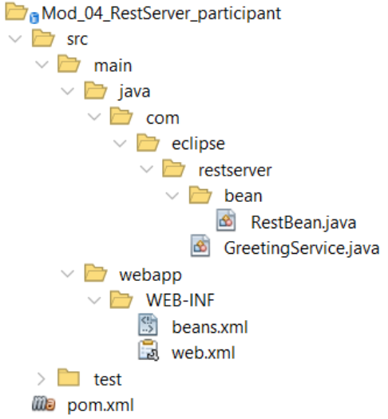
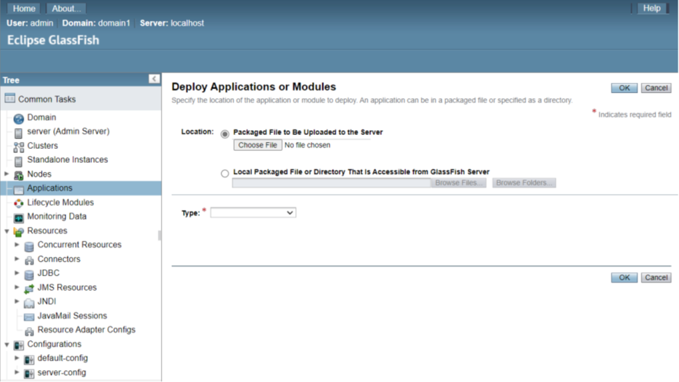
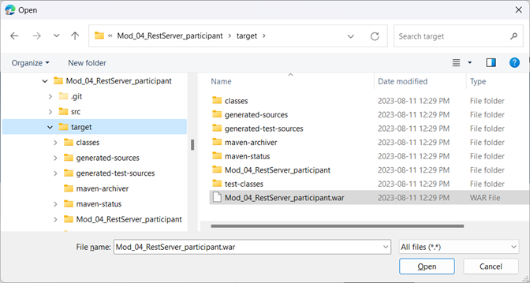
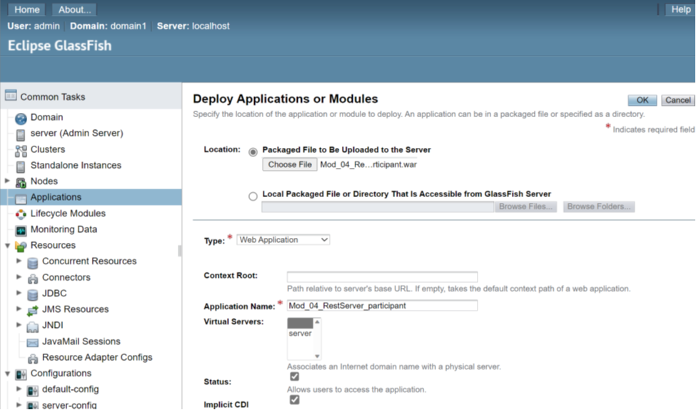

# Jakarta RESTful Web Services 3.1 Workshop

## Participante

**Módulo 4: Implementación de servicios web basados en servidor.**

****

En este módulo desplegaremos nuestro servicio RESTful de interés compuesto a un Servidor de Aplicaciones, en este ejemplo es GlassFish. Por favor, verifique que ha instalado GlassFish y que se está ejecutando. La prueba simple para determinar si todo está bien es iniciar su servidor y probar las siguientes URLs:

Página de bienvenida: <http://localhost:8080>

Página de administración: <http://localhost:4848>

La página de administración del servidor se utilizará para desplegar y desplegar los proyectos web. Si está utilizando un IDE, puede manejar estas tareas dentro del IDE.

El primer paso es revisar el proyecto `mod_04_restserver_participant`. Comencemos por revisar la organización del programa.

### El Proyecto

Se crean servicios web que se ejecutarán en un servidor de aplicaciones como una aplicación web. Esto significa que dicha aplicación también puede contener servlets, archivos HTML, JSP y JSF. Aquí está el diseño Maven del proyecto:



La diferencia de este servicio web respecto al ejemplo del Mod 3 es que asigna los `QueryParams` a un Java Bean y devuelve el resultado como una representación en cadena JSON del bean con el resultado.

Comencemos con el archivo pom de Maven.

### Veamos el archivo pom.xml

La sección de dependencias es ahora bastante corta porque todas las librerías Jakarta son parte del servidor GlassFish. Esto significa que no es necesario añadirlas al archivo war.

```
<dependencies>
   <dependency>
      <groupId>jakarta.platform</groupId>
      <artifactId>jakarta.jakartaee-api</artifactId>
      <version>${jakartaee-api.version}</version>
      <scope>provided</scope>
   </dependency>
</dependencies>
```

La sección build ya no tiene el plugin `Assembly` ya que todas las librerías están disponibles en el servidor. El elemento `<scope>`, establecido a provided, nos dice que cualquier librería requerida para esta dependencia ya está en el contenedor, el servidor de aplicaciones. Tampoco hay ya un `defaultGoal` de `exec:exec` porque este código sólo se ejecuta en un servidor. Esto significa que debemos desplegarlo para ejecutarlo.

### Veamos el web.xml

En los días anteriores a las anotaciones, este archivo XML era donde se configuraba la aplicación. Aunque las anotaciones han reducido muchas de las entradas que antes eran necesarias en este archivo, esta es una situación en la que lo necesitas. Aquí está el archivo web.xml:

```
<web-app version="6.0"
   xmlns="https://jakarta.ee/xml/ns/jakartaee"
   xmlns:xsi="http://www.w3.org/2001/XMLSchema-instance"
   xsi:schemaLocation="https://jakarta.ee/xml/ns/jakartaee
   https://jakarta.ee/xml/ns/jakartaee/web-app_6_0.xsd">
   <servlet>
      <servlet-name>jakarta.ws.rs.core.Application</servlet-name>
   </servlet>
   <servlet-mapping>
      <servlet-name>jakarta.ws.rs.core.Application</servlet-name>
      <url-pattern>/services/*</url-pattern>
   </servlet-mapping>
</web-app>
```

Como necesitamos una clase que extienda `Applications`, el framework Jakarta nos proporciona una en la forma del servlet `jakarta.ws.rs.core.Application`. El servlet-mapping nos permite tener una ruta igual que `@ApplicationPath` en el `RestApplication.java` de `Mod_03_RestSeBootstrap_participant`. No se requiere una clase que extienda Application. El servidor de aplicaciones escaneará el proyecto e identificará todos los servicios buscando `@Path`.

### Veamos el archivo beans.xml

Este archivo no ha cambiado con respecto a la versión del servidor incrustado.

`Veamos el código.`

Estamos utilizando el `GreetingService.java` del Mod 03 con dos cambios. Los valores de `QueryParams` se almacenan en un bean y el tipo de retorno es el `RestBean`. Comencemos examinando el bean.

**RestBean.java**

```
@RequestScoped
public class RestBean {

   private String name;
   private LocalDateTime theTime;
   private String serviceSource;

   public RestBean() {
      this.name = "";
      theTime = LocalDateTime.now();
      serviceSource = "";
   }

   public String getName() {
      return name;
   }

   public void setName(String name) {
      this.name = name;
   }

 // Getters and setters for the remaining fields

   @Override
   public String toString() {
      StringBuilder sb = new StringBuilder();
      sb.append("ServiceBean{");
      sb.append("name=").append(name);
      sb.append(", theTime=").append(theTime);
      sb.append(", serviceSource=").append(serviceSource);
      sb.append('}');
      return sb.toString();
   }
```

Se trata de un Java Bean estándar. Según la definición de un bean tiene un constructor por defecto o sin parámetros. Este es también un requisito de CDI. En el fichero `beans.xml` declaramos que las clases anotadas están sujetas a CDI. En el caso de este bean, probar el alcance o tiempo de vida de un objeto usando `@RequestScoped` hace que este bean esté disponible para CDI.

Veamos el servicio.

**GreetingService.java**

```
@Path("hello")
public class GreetingService {

   @Inject
   private RestBean restBean;

   @GET
   public RestBean hello(@QueryParam("name") String name) {
      if ((name == null) || name.trim().isEmpty()) {
         name = "Anonymous";
      }
      restBean.setName(name);
      restBean.setTheTime(LocalDateTime.now());
      restBean.setServiceSource("GreetingService");
      return restBean;
   }
}
```

The bean used for the Compound Interest calculation was an ordinary Java Bean and it was necessary to instantiate it with new. Moving to CDI we no longer need to instantiate annotated classes and instead we `@Inject` them or use them on a JSF or JSP page. If there is already a CDI instantiated bean, the reference is assigned to the injected variable. If the bean has not been instantiated, then the injected variable is instantiated first.

### Desplegando Mod_04_RestServer_participant

Construye el proyecto usando Maven. Puede hacerlo en su IDE o desde la línea de comandos emitiendo un mvn en la carpeta raíz del proyecto.

Start your GlassFish server as shown in Module 1. Call up the admin panel of Glassfish by opening your browser and enter localhost:4848 as the URL. If you set a password for admin access, you will be asked for your username and password. When the admin screen comes up, select Applications in the Tree. You will next see the list of all deployed applications. This will be empty. Use the Deploy an Application button at the top of the deployed list. You should see:

Inicie su servidor GlassFish como se muestra en el Módulo 1. Abra el panel de administración de Glassfish abriendo su navegador e introduciendo localhost:4848 como URL. Si ha establecido una contraseña para el acceso de administrador, se le pedirá su nombre de usuario y contraseña. Cuando aparezca la pantalla de administración, seleccione Aplicaciones en el Árbol. A continuación verá la lista de todas las aplicaciones desplegadas. Estará vacía. Utilice el botón **Deploy an Application** situado en la parte superior de la lista de aplicaciones desplegadas. Debería ver:



Haga clic en Seleccionar archivo y vaya a la carpeta de destino de su proyecto:



Después de seleccionar su archivo war y hacer clic en Abrir, aparece lo siguiente:



Fíjese en el campo titulado **Context Root**. Aunque indica que se utiliza el nombre de la aplicación si no hay raíz de contexto, no es necesariamente así. Para evitar problemas, introduzca:

```
/Mod_04_RestServer_participant
```

en el campo:


Veamos ahora JSON en acción.

### JSON instantáneo

Hasta ahora, hemos pasado números y cadenas a los servicios web y hemos recibido una cadena a cambio. Esto está bien para servicios simples, pero lo que realmente queremos hacer es pasar objetos a un servicio y recibir un objeto del servicio. Aquí es donde entra JSON.

Para examinar la salida de este servicio, el `ResultBean` como una cadena JSON, entrará en su navegador:

```
http://localhost:8080/Mod_04_RestServer_participant/services/hello
```

o desde la línea de comandos:

```
curl http://localhost:8080/Mod_04_RestServer_participant/services/hello
```

No hay nada más que hacer. Cuando el tipo de retorno es un objeto de estilo JavaBean, esto indica que quieres que el bean se serialice usando JSON. Un tipo de retorno String, una envoltura primitiva como Boolean, o un tipo primitivo como int devolverá el valor y no JSON. Esto no tiene nada que ver con el tipo Request como GET y sus amigos. Reconstruye y despliega este proyecto. Cuando introduzcas la línea anterior en un navegador o uses cURL el resultado será ahora una cadena JSON.

```
{"name":"Anonymous","serviceSource":"GreetingService","theTime":"2023-08-11T14:59:34.5067359"}
```

Ahora vamos a añadir nuestra calculadora compuesta.

### Ahora es tu turno
Take the compound interest calculation service from the embedded server example and turn it into an Application Server hosted web service. Do not add the unit tests. As pointed out already, the equivalent of the `@ApplicationPath` as found in the web.xml `<url-pattern>` tag is `services`. The service class you write should have an `@Path("compound")`. Return the result as a String that is returned from the `CompoundBean’s toString()` method.

Tome el servicio de cálculo de interés compuesto del ejemplo del servidor embebido y conviértalo en un servicio web alojado en el Servidor de Aplicaciones. No añadas las pruebas unitarias. Como ya se ha indicado, el equivalente de `@ApplicationPath` que se encuentra en la etiqueta web.xml `<url-pattern>` es `services`. La clase de servicio que escribas debe tener un `@Path("compound")`. Devuelve el resultado como una cadena devuelta por el método toString()del `CompoundBean`.

Para comprobar si su servicio funciona, utilice un comando cURL como el siguiente. Introdúzcalo en una sola línea.

```
curl "http://localhost:8080/Mod_04_RestServer_participant/services/compound?principal=100&annualInterestRate=0.05&compoundPerTimeUnit=12&time=5"
```

Cambie el tipo de retorno a `CompoundBean` para ver el resultado como una cadena JSON.

**Nota**: *Su estructura de datos puede ser diferente de lo que se ve en este texto. Si ese es el caso, entonces debes estar seguro de tener en tu estructura de datos un constructor por defecto. No hay necesidad de cambiar su código.*

Aquí está la cadena JSON.

```
{"annualInterestRate":0.05,"compoundPerTimeUnit":12.0,"principal":100.0,"result":"128.34","time":5.0}
```

Si utiliza el modificador -i en cURL, verá información sobre el servidor que procesa su solicitud de servicio, como por ejemplo

```
HTTP/1.1 200 OK
Server: Eclipse GlassFish 7.0.6
X-Powered-By: Servlet/6.0 JSP/3.1(Eclipse GlassFish 7.0.6 Java/Eclipse Adoptium/17)
Content-Type: application/json
Content-Length: 101
```

### @POST

Pero, ¿y si desea pasar una serialización JSON de un objeto? De nuevo, la codificación es sencilla. Hay una regla importante relativa al tipo de petición GET. Es sencillo devolver una cadena JSON sustituyendo el tipo de retorno String por el tipo de la clase que se desea devolver. Lo que no se puede hacer es sustituir los `QueryParams` por un objeto. Una `Entidad` es lo que llamamos a un objeto utilizado como parámetro de un método de servicio web. No puedes usar una `Entidad` con GET. Puedes usarlo con POST.

Añada el siguiente método a su clase de servicio web `CompoundInterest`:

```
@POST
public CompoundBean postCompoundInterest(CompoundBean compoundBean) {
   calculateCompoundInterest(compoundBean);
   return compoundBean;
}
```

Utiliza el método que escribiste para realizar el cálculo. En mi código se llama `calculateCompoundInterest`.

Compilar y desplegar el servicio. Para probarlo, necesitamos enviar un JSON representativo de la Entidad. No podemos hacer esto en la barra de direcciones de nuestro navegador. Para probar nuestro código, debemos utilizar cURL.

Linux/MacOS:

```
curl -i -X POST --header "Content-Type: application/json" --data '{ "principal": 100.00,"annualInterestRate": 0.05, "compoundPerTimeUnit": 12.0, "time": 5.0, "result": "0.0" }' http://localhost:8080/Mod_04_RestServer_participant/services/compound
```

Windows debe escapar las comillas **\\**» y no puede utilizar la comilla simple '.

```
curl -i -X POST --header "Content-Type: application/json" --data "{ \"principal\": 100.00, \"annualInterestRate\": 0.05, \"compoundPerTimeUnit\": 12.0, \"time\": 5.0, \"result\": \"0.0\" }" http://localhost:8080/Mod_04_RestServer_participant/services/compound
```

Debe tener un `--header` que muestre el `Content-Type` como `application/json`. La representación JSON sigue a `--data`. Todos los nombres de campo y valores de cadena deben ir entre comillas.

El resultado esperado es:

```
HTTP/1.1 200 OK
Server: Eclipse GlassFish 7.0.6
X-Powered-By: Servlet/6.0 JSP/3.1(Eclipse GlassFish 7.0.6 Java/Eclipse Adoptium/17)
Content-Type: application/json
Content-Length: 101

{"annualInterestRate":0.05,"compoundPerTimeUnit":12.0,"principal":100.0,"result":"128.34","time":5.0}
```

Ahora es el momento de ver los clientes REST y cómo podemos enviar y recibir cadenas JSON a un servicio.
