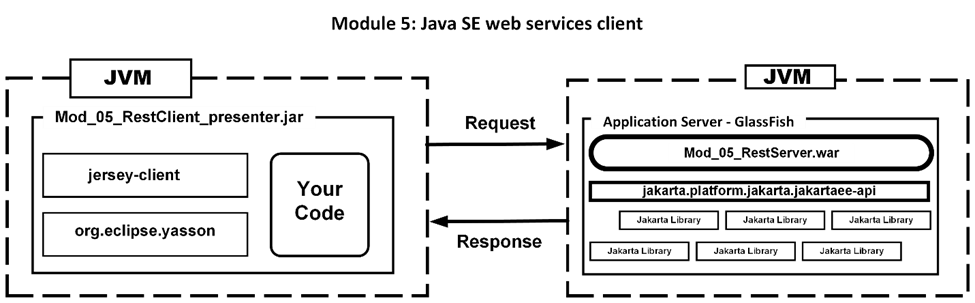
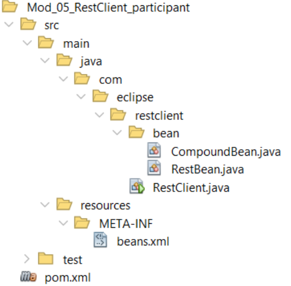

# Jakarta RESTful Web Services 3.1 Workshop Participant

## Módulo 5: Cliente de servicios web Java SE.

****

Ahora que tenemos los servicios web básicos basados en Java SE y en el servidor de aplicaciones, veamos cómo escribir código cliente para utilizar los servicios. Uno de los puntos fuertes de los servicios web es que son independientes del lenguaje. Si se siguen los protocolos HTTP, un cliente escrito en Java puede utilizar un servicio web escrito en C\#. Esto también significa que un cliente escrito en Java SE o, como veremos en el próximo módulo, Servlets/JSF puede acceder a un servicio en cualquier host con sólo utilizar la URL correcta del servicio web.

En este módulo veremos cómo enviar y recibir datos en formato JSON y convertirlos en un objeto Java tanto para un servicio basado en servidor como en SeBootstrap. Se trabajará con dos proyectos:

-   mod_05_restserver
-   mod_05_restclient_participant

El proyecto `Mod_05_RestServer` es un `Mod_04_RestServer` completo con un servicio de interés compuesto funcionando. Construya y despliegue `Mod_05_RestServer` en el servidor GlassFish antes de trabajar con el cliente.

**El Proyecto**

El cliente de este módulo es un cliente Java SE. El código que examinaremos permitirá a cualquier aplicación de escritorio Java SE interactuar con cualquier servicio web REST.



### Veamos el archivo pom.xml

Para este módulo sólo trabajaremos con el cliente Jersey de la librería GlassFish. No estamos utilizando GlassFish, sólo las bibliotecas necesarias para un cliente.

```
<dependency>
   <!-- Client to access a service -->
   <groupId>org.glassfish.jersey.core</groupId>
   <artifactId>jersey-client</artifactId>
   <version>3.1.3</version>
</dependency>
<dependency>
   <!-- Official ref implementation of JSON Binding API(JSR-367) -->
   <groupId>org.eclipse</groupId>
   <artifactId>yasson</artifactId>
   <version>3.0.3</version>
</dependency>
```

La sección `<plugins>` es idéntica a la del proyecto Mod 3 donde todas las dependencias deben ser añadidas al jar final y el objetivo `exec:exec` puede ejecutar el código.

### Veamos el archivo beans.xml

Este archivo es el mismo para todos los ejemplos.

### Veamos el código

Como hemos visto en el Módulo 4, un servicio web puede devolver una representación JSON de un objeto si el tipo de retorno del servicio, GET o POST, es un objeto, como un JavaBean en Java. Esto significa que en el código del cliente necesitamos el mismo código fuente para el Java bean que el servicio web está devolviendo como JSON, el RestBean.java. Esta clase ya está en el proyecto.

En el archivo RestClient.java ya hay un método cliente REST completo llamado `callHelloService`. Examinemos su código.

En este proyecto se utilizará JSON-B, B para el enlace. Así es como convertiremos desde y hacia JSON y un objeto. La primera línea de código creará un objeto `Jsonb` para este propósito.

```
Jsonb jsonb = JsonbBuilder.create();
```

Ahora podemos convertir el `RestBean` que se pasa a `callHelloService` en JSON.

`String restJson = jsonb.toJson(restBean);`

Con esto hecho ya podemos crear el `Client` que nos permitirá enviar y recibir de un servicio.

```
Client client = ClientBuilder.newClient();
```

Con el objeto cliente creado, necesitamos describir dónde está el servicio, su URI, y cualquier parámetro de consulta que desees pasar al servicio. Esto resultará en un objeto `WebTarget`.

```
WebTarget target = client.target(UriBuilder.fromUri(
                  "http://localhost:8080/Mod_05_RestServer/").
                   build());
```

En este ejemplo todos los servicios se encuentran después de la ruta de servicios. Con el objeto `WebTarget`, podemos hacer una petición al servicio `hello`. El nombre del servicio es la `@Path` del servicio. En el caso de `hello` necesitaremos añadir el siguiente código:

```
String serviceReturnJson
   = target.path("services").path("hello").request(
      MediaType.APPLICATION_JSON)
      .post(Entity.entity(restJson, MediaType.APPLICATION_JSON),
      String.class);
```

Esto enviará la representación JSON de un `RestBean` al servicio y recibirá a cambio un nuevo bean como cadena JSON. Ahora tenemos que utilizar JSON-B para convertir la cadena JSON en un `RestBean`.

```
restBean = jsonb.fromJson(serviceReturnJson, RestBean.class);
```

En el método principal de esta clase, se llama a un servicio por:

```
RestClient restClient = new RestClient();
RestBean restBean = new RestBean();
restBean.setName("Ken");
restBean = restClient.callHelloService(restBean);
```

**Tu turno:**

Como el proyecto está completo para ejecutar el servicio hello puedes ejecutarlo con el comando `mvn`. No olvides construir y desplegar en GlassFish el `Mod_05_RestServer` primero. Como no hay interfaz de usuario es necesario examinar la salida de registro del programa. Aquí están sólo las líneas INFO del registro de mi ejecución:

```
INFO:
]]] Conversion of restBean to JSON= {"name":"Ken","serviceSource":"","theTime":"2023-09-21T14:07:46.8935399"}

INFO:
]]] JSON of result from service call = {"name":"Ken","serviceSource":"GreetingService","theTime":"2023-09-21T14:07:47.2445905"}

INFO:
]]] Conversion of JSON string to restBean = JSON{name=Ken, theTime=2023-09-21T14:07:47.244590500, serviceSource=GreetingService}

INFO:
]]] restBean in main = JSON{name=Ken, theTime=2023-09-21T14:07:47.244590500, serviceSource=GreetingService}

INFO:
]]] Conversion of restBean to JSON= {"name":"","serviceSource":"","theTime":"2023-09-21T14:07:47.3194261"}

INFO:
]]] JSON of result from service call = {"name":"Anonymous","serviceSource":"GreetingService","theTime":"2023-09-21T14:07:47.3304238"}

INFO:
]]] Conversion of JSON string to restBean = JSON{name=Anonymous, theTime=2023-09-21T14:07:47.330423800, serviceSource=GreetingService}

INFO:
]]] restBean in main = JSON{name=Anonymous, theTime=2023-09-21T14:07:47.330423800, serviceSource=GreetingService}
```

El `Mod_05_RestServer` ya tiene un servicio `CompoundInterest`. Crea un método para acceder a este servicio. Examina el código fuente del servidor para encontrar la `@Path` del servicio. No olvides que la ruta a todos los servicios empieza por `services`.

Siéntase libre de crear una interfaz de usuario en Swing o JavaFX para los servicios.

En nuestro próximo módulo veremos cómo tener un cliente que pueda utilizar un Servlet o una página JSF.