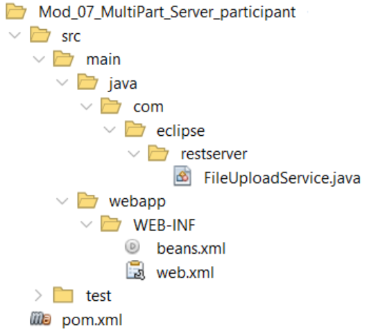

# Jakarta RESTful Web Services 3.1 Workshop Participant

## Módulo 7: Carga de Archivo con Multiparte


Hasta ahora en este taller hemos escrito código para servicios GET y servicios POST. Los servicios GET aceptan cadenas de consulta añadidas a la URL del servicio. Esto significa que hay un número máximo de caracteres permitidos.

POST acepta cadenas de consulta o la representación JSON de un objeto. Las peticiones POST no se añaden a la URL. En su lugar, un POST recibe información del cuerpo del mensaje HTTP para el que no hay limitación de longitud. Esto se denomina multiparte ya que el cuerpo del mensaje está organizado en múltiples partes o segmentos. Si desea cargar un archivo binario, como una imagen, entonces sólo puede utilizar POST y la imagen se transmite como parte del cuerpo del mensaje.

Como veremos en este módulo, transferir archivos binarios a un servicio web es notablemente sencillo.

Trabajaremos con estos tres proyectos:

-   `mod_07_multipart_server_participant`
-   `mod_07_restclientupload_participant`
-   `mod_07_servletclientmultipart_participant`

**TLos Proyectos**

Hay tres proyectos en este módulo. El primero es el servidor `MultiPart` al que los clientes subirán un fichero.



### El archivo pom

El archivo pom es el mismo para todos los módulos basados en servidor con una única dependencia y sin plugins.

###  Veamos el archivo beans.xml

Este archivo es el mismo para todos los ejemplos.

### Veamos el web.xml

Este archivo es idéntico al web.xml del Mod 04.

### Let’s look at the code.

Comenzamos declarando el tipo de solicitud

`@POST`

En este método de servicio es necesario declarar que vamos a utilizar o consumir un cuerpo de mensaje multiparte.

`@Consumes(MediaType.MULTIPART_FORM_DATA)`

La firma del método muestra cuáles serán las dos partes del cuerpo del mensaje. La primera es sólo una cadena y será el nombre del archivo que será guardado por este método. La segunda es una `EntityPart` que representará el fichero que estamos subiendo. No hay necesidad de declarar esto como un archivo binario o de texto ya que esto es determinado por el servicio.

```
public Response uploadFile(@FormParam("name") String part1,  
          @FormParam("part") EntityPart part2) {
```

Para almacenar la `EntityPart` simplemente podemos utilizar el método estático `Files.copy`. El `part2.getContent` es un `InputStream`. El `Paths.get` será la ruta y el nombre de fichero en el que se guardará el fichero. La opción `StandardCopyOption.REPLACE_EXISTING` significa que el fichero se sobrescribirá si ya existe.

**Ajuste la ruta para que coincida con los requisitos de su sistema operativo y el lugar donde desea almacenar el archivo.**

```
try {
   Files.copy(
           part2.getContent(),
           Paths.get("C:/temp2/"+part1),
           StandardCopyOption.REPLACE_EXISTING
);
```

El problema más común es una `IOException` al escribir el archivo. Aquí utilizamos el objeto `Response` para devolver un código de respuesta de error a la persona que llama.

```
} catch (IOException e) {
   return Response.status(Response.Status.INTERNAL_SERVER_ERROR).
            entity(e.getMessage()).build();
}
```

Todo va bien y devuelve una respuesta OK.

```
   return Response.ok("File successfully uploaded!").build();
}
```

Construye y despliega el servicio. Puedes probarlo usando cURL con (una línea):

```
curl -X POST -F name=XXXX.jpg -F part=@C:/temp/XXXX.jpg http://localhost:8080/Mod_07_MultiPart_Server_participant/services/multiparts/
```

Esta línea es para Windows así que por favor cambie el nombre y la parte para que funcione en su sistema.

Ahora veamos a los clientes.

### Los clientes de carga de archivos de escritorio y servlet

Hay dos proyectos cliente. El `RestClientUpload` es una aplicación de escritorio Java SE. El `ServletClientMultiPart` utiliza un Servlet como cliente. Aquí están los diseños de los proyectos:


### El archivo pom

El archivo pom del servlet sólo tiene una dependencia. El pom de Java SE desktop tiene tres dependencias.

```
<dependencies>
   <dependency>
      <!-- This dependency handles MessageBodyWriters. It must be 
           first -->
      <groupId>org.glassfish.jersey.media</groupId>
      <artifactId>jersey-media-multipart</artifactId>
      <version>3.1.3</version>
   </dependency>
   <dependency>
      <!-- Client to access a service -->
      <groupId>org.glassfish.jersey.core</groupId>
      <artifactId>jersey-client</artifactId>
      <version>3.1.3</version>
   </dependency>
   <dependency>
      <groupId>org.glassfish.jersey.inject</groupId>
      <artifactId>jersey-cdi2-se</artifactId>
      <version>3.1.3</version>
   </dependency>
</dependencies>
```

Aunque rara vez nos preocupamos por el orden de las dependencias, el orden puede ser significativo. La dependencia `jersey-media-multipart` debe ser la primera, de lo contrario el programa lanzará excepciones relativas a `MessageBodyWriters`.

El código cliente para utilizar el servicio es prácticamente idéntico en ambos clientes. La única diferencia es que a la versión de escritorio se le pasa el nombre del archivo y la ruta como parámetros del método, mientras que la versión Servlet tiene el nombre del archivo y la ruta codificados. Aquí está el código fuente:

```
public Response callFileUploadService(String fileName, String path)
   throws IllegalStateException, IOException {

   // Step 1: Create a Client object
   Client client = ClientBuilder.newBuilder().build();

   // Step 2: Create a WebTarget object that points to the service
   WebTarget target = client.target(UriBuilder.fromUri(
      "http://localhost:8080/Mod_07_MultiPart_Server_participant/
       services/multiparts"));

   // Step 3: Create an InputStream for the file to upload
   File initialFile = new File(path + fileName);
   InputStream pictureInputStream = new FileInputStream(initialFile);

   // Step 4: Create an EntityPart to hold the InputStream
   EntityPart part = EntityPart.withName("part").fileName(fileName)
      .content(pictureInputStream)
      .mediaType(MediaType.APPLICATION_OCTET_STREAM)
      .build();

   // Step 5: Create an EntityPart to hold the file name
   EntityPart name =    
      EntityPart.withName("name").content(fileName).build();

   // Step 6: Combine the EntityParts into a GenericEntity
   GenericEntity genericEntity =
      new GenericEntity<List<EntityPart>>(List.of(name, part)) {};

   // Step 7: Convert the GenericEntity into an Entity
   Entity entity = Entity.entity(genericEntity,
      MediaType.MULTIPART_FORM_DATA);

   // Step 8:Request the POST FileUploadService with the Entity
   Response response =
      target.request(MediaType.MULTIPART_FORM_DATA).post(entity);
   
   return response;
}
```

En el código del Servlet los pasos 3, 4 y 5 son diferentes debido a la codificación dura del nombre y la ruta. Los pasos 1, 2, 6, 7 y 8 no se modifican:

```
   // Step 3: Create an InputStream for the file to upload
   File initialFile = new File("C:/temp/vwvan1974.jpg");

   // Step 4: Create an EntityPart to hold the InputStream
   EntityPart part =   
      EntityPart.withName("part").fileName("vwvan1978.jpg")
         .content(pictureInputStream)
         .mediaType(MediaType.APPLICATION_OCTET_STREAM)
         .build();

   // Step 5: Create an EntityPart to hold the file name
   EntityPart name =
      EntityPart.withName("name").content("vwvan1974.jpg").build();
```

Cuando construyas y despliegues la versión Servlet, aparecerá un simple archivo HTML con un botón Upload. Si la ventana del navegador se queda en blanco, entonces ha tenido éxito. Verifícalo comprobando la carpeta en la que indicaste que querías que se escribiera el archivo. Considere la posibilidad de mejorar esto.

**Tu turno**

Introduce el código anterior en el método `uploadFile` de la clase `FileUploadService`. Construya el proyecto y despliéguelo en el servidor GlassFish. Para probar si el servicio funciona sigue estos pasos:

Coloca un archivo como una imagen en una carpeta de tu elección y toma nota de la ruta al archivo.

Utilice cURL para llamar al servicio. *Sustituye la ruta y los nombres de archivo por los tuyos.*

```
curl -X POST -F name=vwvan1974.jpg -F part=@C:/temp/vwvan1974.jpg http://localhost:8080/Mod_07_MultiPart_Server_participant/services/
multiparts/
```

Ahora puedes completar el `ServletClient` en `Mod_07_ServletClientMultiPart_participant` y el `RestClient` en `Mod_07_RestClientUpload_participant`.

También puede mejorar la interfaz de usuario en ambos ejemplos. Por ejemplo, crear una aplicación JavaFX que utilice el `FileChooser` para seleccionar un archivo a subir. Mejora el ejemplo Servlet dándole una interfaz de usuario de selección de archivos.
