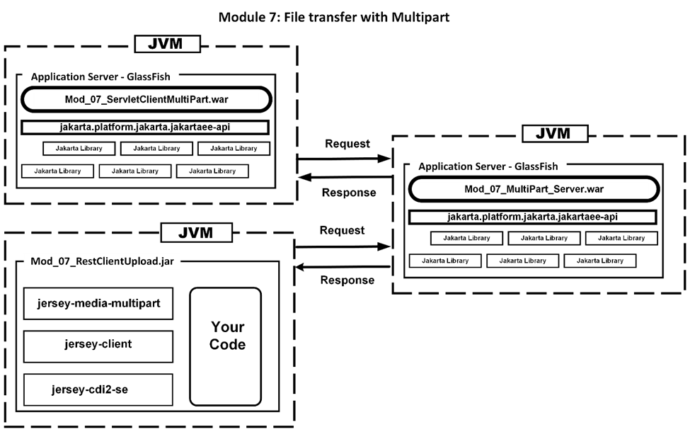

# Jakarta RESTful Web Services 3.1 Workshop Participant

## Module 7: File transfer with Multipart



So far in this workshop we have written code for GET services and POST services. GET services accept Query Strings appended to the URL of the service. This means that there is a maximum number of characters permitted.

POST accepts Query Strings or the JSON representation of an object. POST requests do not append to the URL. Instead, a POST receives input from the HTTP message body for which there is no limitation in length. This is referred to as multi part as the message body is organized into multiple parts or segments. If you wish to upload a binary file, such as an image, then you can only use POST and the image is transmitted as a part of the message body.

As we will see in this module, transferring binary files to a web service is remarkably simple.

We will be working with these three projects:

-   `mod_07_multipart_server_participant`
-   `mod_07_restclientupload_participant`
-   `mod_07_servletclientmultipart_participant`

**The Project**

There are three projects in this module. The first is the `MultiPart` server to which the clients will upload a file.


### The pom file

The pom file is the same for all the server-based modules with just the single dependency and no plugins.

### Let’s look at the beans.xml

This file is the same for all examples.

### Let’s look at the web.xml

This file is identical to the web.xml in Mod 04.

### Let’s look at the code.

We begin by declaring the request type

`@POST`

In this service method it is necessary to declare that we are going to use or consume a multipart message body.

`@Consumes(MediaType.MULTIPART_FORM_DATA)`

The method signature shows what the two parts of the message body will be. The first is just a string and will be the name of the file that will be saved by this method. The second is an `EntityPart` that will represent the file we are uploading. There is no need to declare this as a binary or text file as this is determined by the service.

```
public Response uploadFile(@FormParam("name") String part1,  
          @FormParam("part") EntityPart part2) {
```

To store the `EntityPart` we can simply use the `Files.copy` static method. The `part2.getContent` is an `InputStream`. The `Paths.get` will be the path and file name that the file will be save to. The `StandardCopyOption.REPLACE_EXISTING` means that the file will be overwritten if it already exists.

**Adjust the path to match your OS requirements and where you wish to store the file.**

```
try {
   Files.copy(
           part2.getContent(),
           Paths.get("C:/temp2/"+part1),
           StandardCopyOption.REPLACE_EXISTING
);
```

The most common problem is an `IOException` when writing the file. Here we use the `Response` object to return an error Response code to the caller.

```
} catch (IOException e) {
   return Response.status(Response.Status.INTERNAL_SERVER_ERROR).
            entity(e.getMessage()).build();
}
```

All is well and return an OK response.

```
   return Response.ok("File successfully uploaded!").build();
}
```

Build and deploy the service. You can test it using cURL with (one line):

```
curl -X POST -F name=XXXX.jpg -F part=@C:/temp/XXXX.jpg http://localhost:8080/Mod_07_MultiPart_Server_participant/services/multiparts/
```

This line is for Windows so please change name and part to work on your system.

Now let us look at the clients.

### The desktop and servlet file upload clients

There are two client projects. The `RestClientUpload` is a Java SE desktop application. The `ServletClientMultiPart` uses a Servlet as the client. Here are the project layouts:


### The pom file

The servlet pom file has only the one dependency. The Java SE desktop pom has three dependencies.

```
<dependencies>
   <dependency>
      <!-- This dependency handles MessageBodyWriters. It must be 
           first -->
      <groupId>org.glassfish.jersey.media</groupId>
      <artifactId>jersey-media-multipart</artifactId>
      <version>3.1.3</version>
   </dependency>
   <dependency>
      <!-- Client to access a service -->
      <groupId>org.glassfish.jersey.core</groupId>
      <artifactId>jersey-client</artifactId>
      <version>3.1.3</version>
   </dependency>
   <dependency>
      <groupId>org.glassfish.jersey.inject</groupId>
      <artifactId>jersey-cdi2-se</artifactId>
      <version>3.1.3</version>
   </dependency>
</dependencies>
```

While we rarely concern ourselves with the order of dependencies, the order can significant. The `jersey-media-multipart` dependency must be first otherwise the program will throw exceptions concerning `MessageBodyWriters`.

The actual client code to use the service is near identical in both clients. The only difference is that the desktop version is passed the filename and path as method parameters while the Servlet version has the filename and path hard coded. Here is the source code:

```
public Response callFileUploadService(String fileName, String path)
   throws IllegalStateException, IOException {

   // Step 1: Create a Client object
   Client client = ClientBuilder.newBuilder().build();

   // Step 2: Create a WebTarget object that points to the service
   WebTarget target = client.target(UriBuilder.fromUri(
      "http://localhost:8080/Mod_07_MultiPart_Server_participant/
       services/multiparts"));

   // Step 3: Create an InputStream for the file to upload
   File initialFile = new File(path + fileName);
   InputStream pictureInputStream = new FileInputStream(initialFile);

   // Step 4: Create an EntityPart to hold the InputStream
   EntityPart part = EntityPart.withName("part").fileName(fileName)
      .content(pictureInputStream)
      .mediaType(MediaType.APPLICATION_OCTET_STREAM)
      .build();

   // Step 5: Create an EntityPart to hold the file name
   EntityPart name =    
      EntityPart.withName("name").content(fileName).build();

   // Step 6: Combine the EntityParts into a GenericEntity
   GenericEntity genericEntity =
      new GenericEntity<List<EntityPart>>(List.of(name, part)) {};

   // Step 7: Convert the GenericEntity into an Entity
   Entity entity = Entity.entity(genericEntity,
      MediaType.MULTIPART_FORM_DATA);

   // Step 8:Request the POST FileUploadService with the Entity
   Response response =
      target.request(MediaType.MULTIPART_FORM_DATA).post(entity);
   
   return response;
}
```

In the Servlet code steps 3, 4, and 5 are different due to hard coding the name and path. The steps 1, 2, 6, 7, and 8 are unchanged:

```
   // Step 3: Create an InputStream for the file to upload
   File initialFile = new File("C:/temp/vwvan1974.jpg");

   // Step 4: Create an EntityPart to hold the InputStream
   EntityPart part =   
      EntityPart.withName("part").fileName("vwvan1978.jpg")
         .content(pictureInputStream)
         .mediaType(MediaType.APPLICATION_OCTET_STREAM)
         .build();

   // Step 5: Create an EntityPart to hold the file name
   EntityPart name =
      EntityPart.withName("name").content("vwvan1974.jpg").build();
```

When you build and deploy the Servlet version a simple HTML file will appear with an Upload button. If the browser window goes blank, then it has been successful. Verify by checking the folder you indicated that you want the file written to. Consider improving this.

**Your turn**

Enter the code above into the `FileUploadService` class’s `uploadFile` method. Build the project and deploy it to the GlassFish server. To test if the service works follow these steps:

Place a file such as an image in a folder of your choice and take note of the path to the file.

Use cURL to call upon the service. *Replace the path and file names with your own.*

```
curl -X POST -F name=vwvan1974.jpg -F part=@C:/temp/vwvan1974.jpg http://localhost:8080/Mod_07_MultiPart_Server_participant/services/
multiparts/
```

Now you can complete the `ServletClient` in `Mod_07_ServletClientMultiPart_participant` and the `RestClient` in `Mod_07_RestClientUpload_participant`.

You can also improve the UI in both examples. For example, create a JavaFX application that uses the `FileChooser` to select a file to upload. Improve the Servlet example by giving it a file chooser UI.
