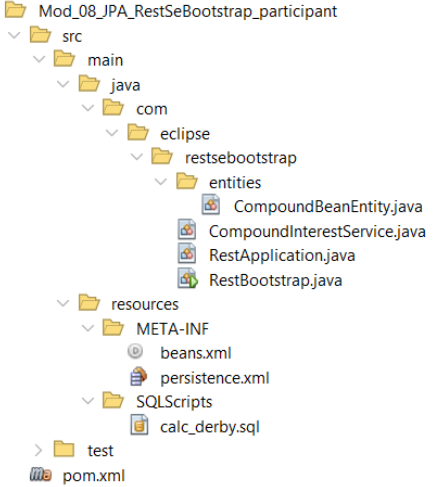
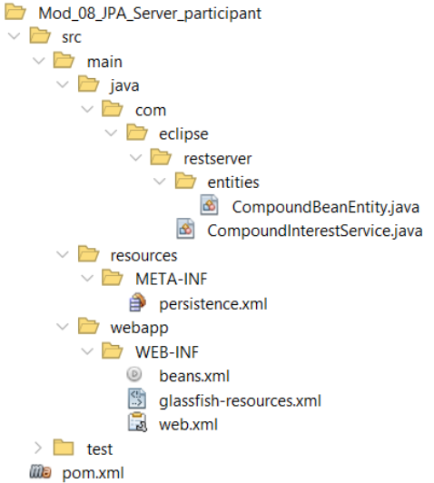
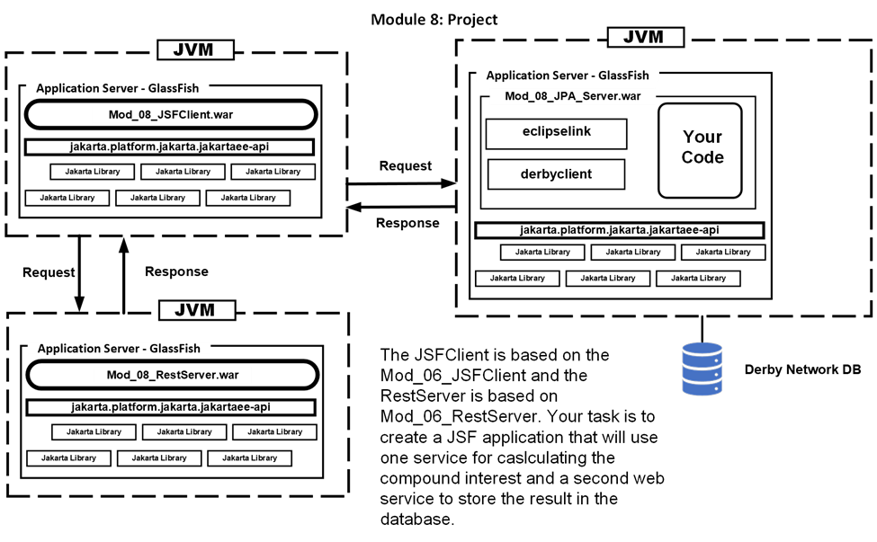

# Jakarta RESTful Web Services 3.1 Workshop Participant

## Module 8: Jakarta Persistence 3.1 & RESTful Web Services 3.1


In this module we will store the Compound Interest input and result into a relational database. The database that we will use is Apache Derby. You are free to use any other DB such as MySQL or Postgres. In the sample code in the SQLFiles folder you will find an SQL script for Derby.

Rather than use JDBC you will be using the Jakarta Persistence 3.1 library. The specific implementation will be EclipseLink. You may also use any framework that supports the Jakarta Persistence 3.1 API such as the most recent version of Hibernate.

There are two versions of this web service that you will work with. These are:

-   `mod_08_jpa_restsebootstrap_participant`
-   `mod_08_jpa_server_participant`

The first is a stand-alone Java SE project and the second is a GlassFish based project.

Before we look at the code let us setup the database.

### The Derby Database

We need a database and corresponding table to store each calculation our RESTful service makes. To start Derby, we need to open a console/terminal and run the program `ij` that is in `\glassfish7\javadb\bin`. This is the Derby found in the GlassFish installation. The location of your Derby may be different. Add this location to your Path.

The first step is to start the Derby Network Server. With the location of Derby in your path, open a terminal/console and enter:

```
startNetworkServer
```

Do not close this console as it will also close the database engine. Assuming that there were no errors we can move on to creating the database and table. At the prompt enter:

```
ij
```

This starts the Derby console. You should see the following but possibly with a different version number.

```
ij version 10.15
ij>
```

With Derby’s console running we can now start the database server. The very first time we must create the database along with a user and password. At the `ij` prompt enter:

```
CONNECT 'jdbc:derby://localhost:1527/calcdb;user=omni;password=Big6Potato;
create=true';
```

If all goes well, you will return to the `ij` prompt. The next time you use `ij` you need only enter:

```
CONNECT 'jdbc:derby://localhost:1527/calcdb;user=omni;password=Big6Potato';
```

Once successfully connected you can run SQL scripts. Here is ours, named `calc_derby.sql`, that will create the database and insert one row of data. You can find this file in the project at `Mod_08_JPA_RestSeBootstrap_participant\src\main\resources\SQLScripts`:

```
CREATE TABLE calculations(
   id INTEGER NOT NULL PRIMARY KEY GENERATED ALWAYS AS IDENTITY
      (START WITH 1, INCREMENT BY 1),
   principal DOUBLE,
   annualInterestRate DOUBLE,
   compoundPerTimeUnit DOUBLE,
   time DOUBLE,
   result VARCHAR(25));

INSERT INTO calculations(principal, annualInterestRate,    
   compoundPerTimeUnit, time, result)
   values(34, 0.13, 12, 6, '73.85');
```

If you have created a service other than Compound Interest, then edit this file to reflect the fields in your entity.

To run the script, you must also include the full path to the script. Adjust the following to match where you have cloned the project. At the `ij` prompt enter:

```
RUN 'Mod_08_JPA_RestSeBootstrap_participant\src\main\resources\SQLScripts\calc_derby.sql';
```

Assuming there are no error messages you can enter at the `ij` prompt:

```
SELECT * FROM calculations;
```

You should see the one record in the database. You can leave the Derby ij console open so that you can verify that you have successfully written records to the database from your code.

Now let us look at the projects starting with the SeBootstrap version.

### The mod_08_jpa_restsebootstrap_participant Project

This Java SE project is based on Mod 03 with the compound interest code already in the project. In addition, the necessary files and changes to the pom/xml file to support the JPA are in place:



Let us begin with the Maven pom file.

### Let’s look at the pom.xml file

This project is a variation of Mod 3. We just need to add the dependencies for the JPA.

```
<dependency>
   <!—The EclipseLink implementation -->
   <groupId>org.eclipse.persistence</groupId>
   <artifactId>eclipselink</artifactId>
   <version>4.0.2</version>
</dependency>
<dependency>
   <!—The Derby JDBC driver -->
   <groupId>org.apache.derby</groupId>
   <artifactId>derbyclient</artifactId>
   <version>10.16.1.1</version>
</dependency>
```

### Let’s look at the beans.xml

This file is the same in all projects.

### Let’s look at the persistence.xml

This is the file that configures the JPA to access the database. In this standalone project all the required information is in this file. When we look at the server based version we will see that this information is spread over two file.

```
<persistence-unit name="workshopPU" transaction-type="RESOURCE_LOCAL">
```

The source code can reference the persistence context using the name.

Transactions will be managed by the local instance of the JPA.

```
<provider>org.eclipse.persistence.jpa.PersistenceProvider</provider>
```

The EclipseLink provider class.

```
<class>com.eclipse.restsebootstrap.entities.CompoundBeanEntity</class>
```

The entity class that will be persisted to the database.

```
<exclude-unlisted-classes>true</exclude-unlisted-classes>
```

There are no other entity classes to be discovered.

The following properties describe how to connect to the Derby DBMS.

```
   <properties>
      <property name="javax.persistence.jdbc.driver"
            value="jdbc:derby://localhost:1527/calcdb" />
      <property name="jakarta.persistence.jdbc.url"
            value="jdbc:derby://localhost:1527/calcdb"/>
      <property name="jakarta.persistence.jdbc.user" value="omni"/>
      <property name="jakarta.persistence.jdbc.password"
            value="Big6Potato"/>
   </properties>
</persistence-unit>
```

### Let’s look at RestBootstrap.java

This file is unchanged from Mod 3.

### Let’s look at RestApplication.java

The only change from Mod 3 is that there is no `GreetingService` so it is not included in the set of services.

```
return Set.of(CompoundInterestService.class);
```

### Let’s look at CompoundBeanEntity.java

The first change in this file is that instead of a simple JavaBean, this bean is annotated to be a JPA entity.

```
@Entity
@Table(name = "calculations")
public class CompoundBeanEntity {

   @Id
   @GeneratedValue(strategy = GenerationType.IDENTITY)
   private Long id;
   private double principal;
   private double annualInterestRate;
   private double compoundPerTimeUnit;
    private double time;
   private String result;
   public CompoundBeanEntity() {
   }
```

An Entity class must have a default no-arg constructor. It still has a non-default constructor as well. The setters, getters, and toString are identical to the CompoundBean found in previous examples. If you chose to create a different service rather than calculating compound interest, then you can make the necessary changes to your bean to make it an entity.

### Let’s look at CompoundInterestService.java

This class has the methods `calculateCompoundInterest` and `validateBean` that perform validation and calculation. If you chose to create a different service rather than calculating compound interest then you can replace this code with yours.

Here is the code for the method that responds to a GET:

```
@GET
public String sayCompoundInterest(
      @QueryParam("principal") double principal,
      @QueryParam("annualInterestRate") double annualInterestRate,
      @QueryParam("compoundPerTimeUnit") double compoundPerTimeUnit,
      @QueryParam("time") double time) {

   var compoundBeanEntity = new CompoundBeanEntity(principal,
              annualInterestRate,
              compoundPerTimeUnit, time);
   calculateCompoundInterest(compoundBeanEntity);
   storeResult(compoundBeanEntity);
   return "Compound Interest:\n" + compoundBeanEntity.toString();
}
```

Enter this code into the `sayCompoundInterest` method.

Here is the code that persists the `CompoundBeanEntity` to the database:

```
private void storeResult(CompoundBeanEntity compoundBeanEntity) {
    EntityManagerFactory emf = Persistence.createEntityManagerFactory(
         "workshopPU");
   EntityManager entityManager = emf.createEntityManager();
   entityManager.getTransaction().begin();
   entityManager.persist(compoundBeanEntity);
   entityManager.getTransaction().commit();
}
```

Enter this code into the `storeResult` method.

To create an `EntityManager` in a JavaSE application we instantiate an `EntityManagerFactory` based on the persistence unit name from the persistence.xml file. From this we can create the `EntityManager`. To create the required transaction, we use `begin` and `commit` around the `persist`.

### Let’s run it!

Compile and execute the `mod_08_jpa_restsebootstrap_participant` project. The embedded server will start up and keep running until you kill the process. As we do not have a client program, we will use cURL to test it. Open a console/terminal and enter:

```
curl "http://localhost:8080/services/compound?principal=100.00&annualInterestRate=0.05&compoundPerTimeUnit=12.0&time=5.0
```

You must enter this as a single line. If it was successful it should show:

```
Compound Interest:
CompoundBeanEntity{principal=100.0, annualInterestRate=0.05, compoundPerTimeUnit=12.0, time=5.0, result=128.34}
```

Go to the `ij` console and enter:

```
SELECT * FROM calculations;
```

There should now be two records.

Now let us look at the server based JPA service.

### The mod_08_jpa_server_participant project

This is a server project based on Mod 4. It will accept only POST requests. The code for accepting GET requests is identical to the SeBootstrap version you just worked on so you can easily add it if you wish to. In addition, the necessary configuration files and changes to the pom.xml file to support the JPA are in place:



**Let’s look at the pom.xml file**

The pom.xml file has only two additional dependencies as compared to all previous server-based examples that had only one dependency. These are the JPA dependencies we used in the SeBootstrap version.

```
<dependency>
   <!—The EclipseLink implementation -->
   <groupId>org.eclipse.persistence</groupId>
   <artifactId>eclipselink</artifactId>
   <version>4.0.2</version>
</dependency>
<dependency>
   <!—The Derby JDBC driver -->
   <groupId>org.apache.derby</groupId>
   <artifactId>derbyclient</artifactId>
   <version>10.16.1.1</version>
</dependency>
```

### Let’s look at the beans.xml

This file is the same in all projects.

### Let’s look at the persistence.xml

This file is changed from the SeBootstrap as the JPA is managed by the server.

```
<persistence-unit name="workshopPU" transaction-type="JTA">
  <provider>org.eclipse.persistence.jpa.PersistenceProvider</provider>
  <jta-data-source>java:app/jdbc/myDerby</jta-data-source>
```

This line is new and connects the context to the glassfish-resources.xml file so that GlassFish can manage the JPA.

```
  <class>com.eclipse.restserver.entities.CompoundBeanEntity</class>
  <exclude-unlisted-classes>true</exclude-unlisted-classes>
</persistence-unit>
```

### Let’s look at the glassfish-resources.xml

The connection to Derby is now in this file. Connections are now pooled with a default size of 8.

```
<resources>
   <jdbc-resource enabled="true"
         jndi-name="java:app/jdbc/myDerby"
         object-type="user"
         pool-name="connectionPool">
      <description/>
   </jdbc-resource>
   <jdbc-connection-pool
      datasource-classname="org.apache.derby.jdbc.ClientDataSource"
      name="connectionPool"
      res-type="javax.sql.DataSource">
     <property name="URL" value="jdbc:derby://localhost:1527/calcdb"/>
     <property name="serverName" value="localhost"/>
     <property name="PortNumber" value="1527"/>
     <property name="DatabaseName" value="calcdb"/>
     <property name="User" value="omni"/>
     <property name="Password" value="Big6Potato"/>
   </jdbc-connection-pool>
</resources>
```

### Let’s look at CompoundBeanEntity.java

Unchanged from the SeBootstrap version.

### Let’s look at CompoundInterestService.java

This class is similar to the SeBootstrap version. The first change is how the `EntityManager` and `UserTransaction` are declared.

```
   @PersistenceContext(unitName = "workshopPU")
   private EntityManager entityManager;
   @Resource
   private UserTransaction utx;
```

GlassFish creates these objects and injects their reference.

The Post method is:

```
   @POST
   public CompoundBeanEntity postCompoundInterest(
               CompoundBeanEntity compoundBeanEntity) {
      calculateCompoundInterest(compoundBeanEntity);
      storeResult(compoundBeanEntity);
      return compoundBeanEntity;
   }
```

Enter this code into the `postCompoundInterest` method.

POST is receiving the object as a JSON string that is transformed directly into a `CompoundBeanEntity`. It returns the same bean but with the result of the calculation added. This will appear as a JSON string when called with cURL.

The `storeResult` method is also changed to reflect that it does not need to create an `EntityManager` or transaction.

```
   private void storeResult(CompoundBeanEntity compoundBeanEntity) {
      
      try {
         utx.begin();
         entityManager.persist(compoundBeanEntity);
         utx.commit();
      } catch (NotSupportedException | SystemException |
             RollbackException | HeuristicMixedException |
             HeuristicRollbackException | SecurityException |
             IllegalStateException ex) {
         Logger.getLogger(CompoundInterestService.class.getName()).
            log(Level.SEVERE, null, ex);
      }
   }
```

Enter this code into the `storeResult` method.

Note the long list of things that go wrong in the catch. In a production environment you may wish to treat each of these issues separately and not in a multi catch.

### Let’s run it!

Compile and deploy the `mod_08_jpa_server_participant` project. If it deploys successfully your browser will open with a HTTP Status 404 - Not Found web page. As we do not have a client program, we will use cURL to test it. Open a console/terminal and enter:

Windows:

```
curl -i -X POST --header "Content-Type: application/json" --data "{ \"principal\": 100.00, \"annualInterestRate\": 0.05, \"compoundPerTimeUnit\": 12.0, \"time\": 5.0, \"result\": \"0.0\" }" http://localhost:8080/Mod_08_JPA_Server_participant/services/compound
```

Linux/MacOS

```
curl -i -X POST --header "Content-Type: application/json" --data '{\"principal": 100.00, "annualInterestRate": 0.05, "compoundPerTimeUnit": 12.0, "time": 5.0, "result": "0.0" } ' http://localhost:8080/Mod_08_JPA_Server_participant/services/compound
```

Note that Windows requires the \\" while Linux and MacOS may not. If it works you should see in the console:

```
HTTP/1.1 200 OK
Server: Eclipse GlassFish 7.0.6
X-Powered-By: Servlet/6.0 JSP/3.1(Eclipse GlassFish 7.0.6 Java/Eclipse Adoptium/17)
Content-Type: application/json
Content-Length: 110

{"annualInterestRate":0.05,"compoundPerTimeUnit":12.0,"id":207,"principal":100.0,"result":"128.34","time":5.0}
```

### What’s next?

On the next page is a project diagram for you to complete.



As you can see, you will need to modify three projects to complete this project.

**We hope that you have learned how easy REST services can be with Jakarta and that you will be inspired to use this in your next project.**
