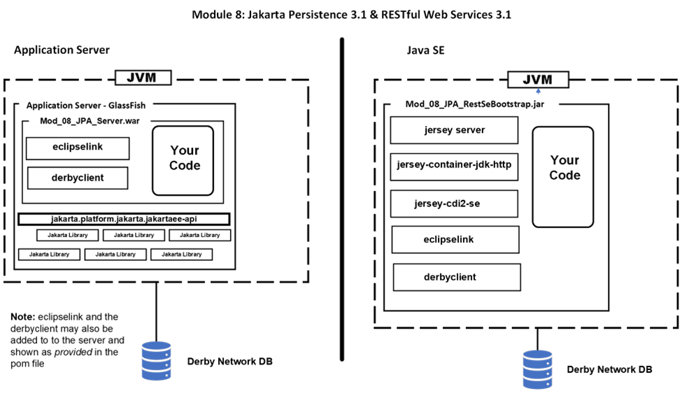

# Jakarta RESTful Web Services 3.1 Workshop Participant

## Módulo 8: Jakarta Persistence 3.1 & RESTful Web Services 3.1



En este módulo almacenaremos la entrada y el resultado del Interés Compuesto en una base de datos relacional. La base de datos que utilizaremos es Apache Derby. Usted es libre de utilizar cualquier otra DB como MySQL o Postgres. En el código de ejemplo de la carpeta SQLFiles encontrará un script SQL para Derby.

En lugar de utilizar JDBC se utilizará la librería Jakarta Persistence 3.1. La implementación específica será EclipseLink. También puedes utilizar cualquier framework que soporte la API Jakarta Persistence 3.1 como la versión más reciente de Hibernate.

Existen dos versiones de este servicio web con las que trabajará. Éstas son:

-   `mod_08_jpa_restsebootstrap_participant`
-   `mod_08_jpa_server_participant`

El primero es un proyecto Java SE independiente y el segundo es un proyecto basado en GlassFish.

Antes de ver el código vamos a configurar la base de datos.

### Base de datos Derby

Necesitamos una base de datos y su correspondiente tabla para almacenar cada cálculo que realice nuestro servicio RESTful. Para iniciar Derby, necesitamos abrir una consola/terminal y ejecutar el programa `ij` que está en `\glassfish7\javadb\bin`. Este es el Derby que se encuentra en la instalación de GlassFish. La ubicación de su Derby puede ser diferente. Añada esta ubicación a su ruta.

El primer paso es iniciar el servidor de red Derby. Con la ubicación de Derby en su ruta, abra un terminal/consola e introduzca:

```
startNetworkServer
```

No cierre esta consola ya que también cerrará el motor de base de datos. Asumiendo que no hubo errores podemos pasar a crear la base de datos y la tabla. En el prompt introduzca:

```
ij
```

Esto inicia la consola Derby. Debería ver lo siguiente pero posiblemente con un número de versión diferente.
```
ij version 10.15
ij>
```

Con la consola de Derby en funcionamiento ya podemos iniciar el servidor de base de datos. La primera vez debemos crear la base de datos junto con un usuario y una contraseña. En el prompt `ij` introduzca:

```
CONNECT 'jdbc:derby://localhost:1527/calcdb;user=omni;password=Big6Potato;
create=true';
```

Si todo va bien, volverá a la pantalla `ij`. La próxima vez que utilice `ij` sólo tendrá que introducir:

```
CONNECT 'jdbc:derby://localhost:1527/calcdb;user=omni;password=Big6Potato';
```

Una vez conectado con éxito puede ejecutar scripts SQL. Aquí está el nuestro, llamado `calc_derby.sql`, que creará la base de datos e insertará una fila de datos. 
Puedes encontrar este archivo en el proyecto en `Mod_08_JPA_RestSeBootstrap_participant\src\main\resources\SQLScripts`:

```
CREATE TABLE calculations(
   id INTEGER NOT NULL PRIMARY KEY GENERATED ALWAYS AS IDENTITY
      (START WITH 1, INCREMENT BY 1),
   principal DOUBLE,
   annualInterestRate DOUBLE,
   compoundPerTimeUnit DOUBLE,
   time DOUBLE,
   result VARCHAR(25));

INSERT INTO calculations(principal, annualInterestRate,    
   compoundPerTimeUnit, time, result)
   values(34, 0.13, 12, 6, '73.85');
```

Si ha creado un servicio distinto de Interés Compuesto, edite este archivo para reflejar los campos de su entidad.

Para ejecutar el script, también debe incluir la ruta completa al script. Ajusta lo siguiente para que coincida con el lugar donde has clonado el proyecto. En el prompt `ij` introduzca:

```
RUN 'Mod_08_JPA_RestSeBootstrap_participant\src\main\resources\SQLScripts\calc_derby.sql';
```

Suponiendo que no hay mensajes de error que puede entrar en el `ij` prompt:

```
SELECT * FROM calculations;
```

Debería ver un registro en la base de datos. Puede dejar la consola Derby ij abierta para que pueda verificar que ha escrito correctamente registros en la base de datos desde su código.

Veamos ahora los proyectos empezando por la versión SeBootstrap.

### El Proyecto mod_08_jpa_restsebootstrap_participant 

Este proyecto Java SE se basa en el Mod 03 con el código de interés compuesto ya en el proyecto. Además, los archivos necesarios y los cambios en el archivo pom/xml para apoyar la JPA están en su lugar:


Comencemos con el archivo pom de Maven.

### Veamos el archivo pom.xml

Este proyecto es una variación del Mod 3. Sólo tenemos que añadir las dependencias para el JPA.

```
<dependency>
   <!—The EclipseLink implementation -->
   <groupId>org.eclipse.persistence</groupId>
   <artifactId>eclipselink</artifactId>
   <version>4.0.2</version>
</dependency>
<dependency>
   <!—The Derby JDBC driver -->
   <groupId>org.apache.derby</groupId>
   <artifactId>derbyclient</artifactId>
   <version>10.16.1.1</version>
</dependency>
```

### Veamos el archivo beans.xml

Este archivo es el mismo para todos los ejemplos.

### Veamos el archivo persistence.xml

Este es el archivo que configura el JPA para acceder a la base de datos. En este proyecto independiente toda la información necesaria se encuentra en este archivo. Cuando nos fijamos en la versión basada en servidor veremos que esta información se distribuye en dos archivos.

```
<persistence-unit name="workshopPU" transaction-type="RESOURCE_LOCAL">
```

El código fuente puede hacer referencia al contexto de persistencia utilizando el nombre.

Las transacciones serán gestionadas por la instancia local de la JPA.

```
<provider>org.eclipse.persistence.jpa.PersistenceProvider</provider>
```

La clase del proveedor de EclipseLink.

```
<class>com.eclipse.restsebootstrap.entities.CompoundBeanEntity</class>
```

La clase de entidad que se persistirá en la base de datos.

```
<exclude-unlisted-classes>true</exclude-unlisted-classes>
```

No hay otras clases de entidades por descubrir.

Las siguientes propiedades describen cómo conectarse al DBMS Derby.
```
   <properties>
      <property name="javax.persistence.jdbc.driver"
            value="jdbc:derby://localhost:1527/calcdb" />
      <property name="jakarta.persistence.jdbc.url"
            value="jdbc:derby://localhost:1527/calcdb"/>
      <property name="jakarta.persistence.jdbc.user" value="omni"/>
      <property name="jakarta.persistence.jdbc.password"
            value="Big6Potato"/>
   </properties>
</persistence-unit>
```

### Miremos el archivo RestBootstrap.java

Este archivo no ha cambiado desde el Mod 3.

### Miremos el archivo RestApplication.java

El único cambio respecto al Mod 3 es que no existe `GreetingService` por lo que no se incluye en el conjunto de servicios.

```
return Set.of(CompoundInterestService.class);
```

### Miremos el archivo CompoundBeanEntity.java

El primer cambio en este archivo es que en lugar de un simple JavaBean, este bean está anotado para ser una entidad JPA.

```
@Entity
@Table(name = "calculations")
public class CompoundBeanEntity {

   @Id
   @GeneratedValue(strategy = GenerationType.IDENTITY)
   private Long id;
   private double principal;
   private double annualInterestRate;
   private double compoundPerTimeUnit;
    private double time;
   private String result;
   public CompoundBeanEntity() {
   }
```

Una clase Entity debe tener un constructor no-arg por defecto. También tiene un constructor no predeterminado. Los setters, getters, y toString son idénticos al CompoundBean encontrado en los ejemplos anteriores. Si eligió crear un servicio diferente en lugar de calcular el interés compuesto, entonces puede hacer los cambios necesarios a su bean para convertirlo en una entidad.

### Miremos el archivo CompoundInterestService.java

Esta clase tiene los métodos `calculateCompoundInterest` y `validateBean` que realizan la validación y el cálculo. Si decides crear un servicio diferente en lugar de calcular el interés compuesto, puedes sustituir este código por el tuyo.

Aquí está el código para el método que responde a un GET:

```
@GET
public String sayCompoundInterest(
      @QueryParam("principal") double principal,
      @QueryParam("annualInterestRate") double annualInterestRate,
      @QueryParam("compoundPerTimeUnit") double compoundPerTimeUnit,
      @QueryParam("time") double time) {

   var compoundBeanEntity = new CompoundBeanEntity(principal,
              annualInterestRate,
              compoundPerTimeUnit, time);
   calculateCompoundInterest(compoundBeanEntity);
   storeResult(compoundBeanEntity);
   return "Compound Interest:\n" + compoundBeanEntity.toString();
}
```

Introduce este código en el método `sayCompoundInterest`.

Aquí está el código que persiste el `CompoundBeanEntity` a la base de datos:

```
private void storeResult(CompoundBeanEntity compoundBeanEntity) {
    EntityManagerFactory emf = Persistence.createEntityManagerFactory(
         "workshopPU");
   EntityManager entityManager = emf.createEntityManager();
   entityManager.getTransaction().begin();
   entityManager.persist(compoundBeanEntity);
   entityManager.getTransaction().commit();
}
```

Introduzca este código en el método `storeResult`.
Para crear un `EntityManager` en una aplicación JavaSE instanciamos un `EntityManagerFactory` basándonos en el nombre de la unidad de persistencia del archivo persistence.xml. A partir de ahí podemos crear el `EntityManager`. Para crear la transacción requerida, usamos `begin` y `commit` alrededor de `persist`.

### Vamos a correrlo!

Compila y ejecuta el proyecto `mod_08_jpa_restsebootstrap_participant`. El servidor embebido se iniciará y seguirá funcionando hasta que elimines el proceso. Como no tenemos un programa cliente, usaremos cURL para probarlo. Abre una consola/terminal e introduce:
```
curl "http://localhost:8080/services/compound?principal=100.00&annualInterestRate=0.05&compoundPerTimeUnit=12.0&time=5.0
```

Debe introducirlo en una sola línea. Si se ha realizado correctamente, debería aparecer:

```
Compound Interest:
CompoundBeanEntity{principal=100.0, annualInterestRate=0.05, compoundPerTimeUnit=12.0, time=5.0, result=128.34}
```

Ve a la consola `ij` e introduce:

```
SELECT * FROM calculations;
```

Ahora debería haber dos registros.

Ahora veamos el servicio JPA basado en servidor.

### El proyecto  mod_08_jpa_server_participant

Este es un proyecto de servidor basado en Mod 4. Sólo aceptará peticiones POST. El código para aceptar peticiones GET es idéntico al de la versión SeBootstrap en la que acabas de trabajar, así que puedes añadirlo fácilmente si lo deseas. Además, los archivos de configuración necesarios y los cambios en el archivo pom.xml para apoyar la JPA están en su lugar:


**Miremos el archivo pom.xml**

El archivo pom.xml tiene sólo dos dependencias adicionales en comparación con todos los ejemplos anteriores basados en servidor que tenían sólo una dependencia. Estas son las dependencias JPA que utilizamos en la versión SeBootstrap.
```
<dependency>
   <!—The EclipseLink implementation -->
   <groupId>org.eclipse.persistence</groupId>
   <artifactId>eclipselink</artifactId>
   <version>4.0.2</version>
</dependency>
<dependency>
   <!—The Derby JDBC driver -->
   <groupId>org.apache.derby</groupId>
   <artifactId>derbyclient</artifactId>
   <version>10.16.1.1</version>
</dependency>
```

###  Miremos el archivo beans.xml

Este archivo es el mismo para todos los ejemplos.

### Miremos el archivo persistence.xml

Este archivo se cambia desde el SeBootstrap ya que el JPA es gestionado por el servidor.

```
<persistence-unit name="workshopPU" transaction-type="JTA">
  <provider>org.eclipse.persistence.jpa.PersistenceProvider</provider>
  <jta-data-source>java:app/jdbc/myDerby</jta-data-source>
```

Esta línea es nueva y conecta el contexto al fichero glassfish-resources.xml para que GlassFish pueda gestionar el JPA.

```
  <class>com.eclipse.restserver.entities.CompoundBeanEntity</class>
  <exclude-unlisted-classes>true</exclude-unlisted-classes>
</persistence-unit>
```

### Miremos el archivo glassfish-resources.xml

La conexión a Derby está ahora en este archivo. Las conexiones se agrupan ahora con un tamaño por defecto de 8.
```
<resources>
   <jdbc-resource enabled="true"
         jndi-name="java:app/jdbc/myDerby"
         object-type="user"
         pool-name="connectionPool">
      <description/>
   </jdbc-resource>
   <jdbc-connection-pool
      datasource-classname="org.apache.derby.jdbc.ClientDataSource"
      name="connectionPool"
      res-type="javax.sql.DataSource">
     <property name="URL" value="jdbc:derby://localhost:1527/calcdb"/>
     <property name="serverName" value="localhost"/>
     <property name="PortNumber" value="1527"/>
     <property name="DatabaseName" value="calcdb"/>
     <property name="User" value="omni"/>
     <property name="Password" value="Big6Potato"/>
   </jdbc-connection-pool>
</resources>
```

### Miremos el archivo CompoundBeanEntity.java

Sin cambios respecto a la versión con SeBootstrap.

### Miremos el archivo CompoundInterestService.java

Esta clase es similar a la versión SeBootstrap. El primer cambio es cómo se declaran el `EntityManager` y `UserTransaction`.

```
   @PersistenceContext(unitName = "workshopPU")
   private EntityManager entityManager;
   @Resource
   private UserTransaction utx;
```

GlassFish crea estos objetos e inyecta su referencia.

El método Post es:

```
   @POST
   public CompoundBeanEntity postCompoundInterest(
               CompoundBeanEntity compoundBeanEntity) {
      calculateCompoundInterest(compoundBeanEntity);
      storeResult(compoundBeanEntity);
      return compoundBeanEntity;
   }
```

Introduzca este código en el método `postCompoundInterest`.

POST recibe el objeto como una cadena JSON que se transforma directamente en una `CompoundBeanEntity`. Devuelve el mismo bean pero con el resultado del cálculo añadido. Esto aparecerá como una cadena JSON cuando se llame con cURL.

El método `storeResult` también ha cambiado para reflejar que no necesita crear un `EntityManager` o transacción.

```
   private void storeResult(CompoundBeanEntity compoundBeanEntity) {
      
      try {
         utx.begin();
         entityManager.persist(compoundBeanEntity);
         utx.commit();
      } catch (NotSupportedException | SystemException |
             RollbackException | HeuristicMixedException |
             HeuristicRollbackException | SecurityException |
             IllegalStateException ex) {
         Logger.getLogger(CompoundInterestService.class.getName()).
            log(Level.SEVERE, null, ex);
      }
   }
```

Introduzca este código en el método `storeResult`.

Observe la larga lista de cosas que van mal en la captura. En un entorno de producción es posible que desee tratar cada uno de estos problemas por separado y no en una captura múltiple.

### Vamos a correrlo!

Compile y despliegue el proyecto `mod_08_jpa_server_participant`. Si se despliega correctamente su navegador se abrirá con una página web HTTP Status 404 - Not Found. Como no tenemos un programa cliente, utilizaremos cURL para probarlo. Abre una consola/terminal e introduce:

Windows:

```
curl -i -X POST --header "Content-Type: application/json" --data "{ \"principal\": 100.00, \"annualInterestRate\": 0.05, \"compoundPerTimeUnit\": 12.0, \"time\": 5.0, \"result\": \"0.0\" }" http://localhost:8080/Mod_08_JPA_Server_participant/services/compound
```

Linux/MacOS

```
curl -i -X POST --header "Content-Type: application/json" --data '{\"principal": 100.00, "annualInterestRate": 0.05, "compoundPerTimeUnit": 12.0, "time": 5.0, "result": "0.0" } ' http://localhost:8080/Mod_08_JPA_Server_participant/services/compound
```

Tenga en cuenta que Windows requiere el \\ mientras que Linux y MacOS puede que no. Si funciona deberías ver en la consola:
```
HTTP/1.1 200 OK
Server: Eclipse GlassFish 7.0.6
X-Powered-By: Servlet/6.0 JSP/3.1(Eclipse GlassFish 7.0.6 Java/Eclipse Adoptium/17)
Content-Type: application/json
Content-Length: 110

{"annualInterestRate":0.05,"compoundPerTimeUnit":12.0,"id":207,"principal":100.0,"result":"128.34","time":5.0}
```

### ¿Qué es lo siguiente?

En la página siguiente encontrará un diagrama del proyecto que deberá completar.


Como puedes ver, necesitarás modificar tres proyectos para completar este proyecto.

**Esperamos que hayas aprendido lo fácil que pueden ser los servicios REST con Jakarta y que te sientas inspirado para utilizarlo en tu próximo proyecto.**
